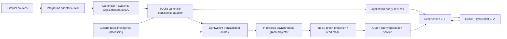
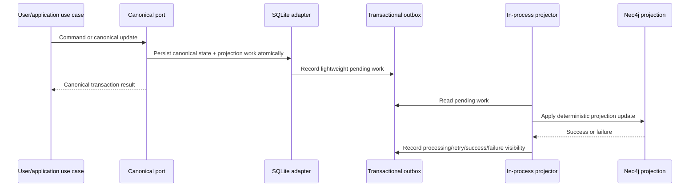

# VECTOR — Architecture Specification

## 1. Status and scope

- Status: CLOSED / EXTERNAL QUALITY GATE PASSED
- Step: Step 9 — Architecture Specification
- External Quality Gate: PASS
- SDD status: NOT_READY_FOR_IMPLEMENTATION
- SPEC-BLOCKERS: 0

This specification materializes the approved V1 logical architecture and its boundaries. It is implementation-guiding but not implementation code. It does not define corporate production topology, exact capacity, cloud services, physical database schemas, table structures, Cypher, final API contracts, pixel-level UX, or source code.

Steps 0–8 remain CLOSED. Their canonical, functional, integration, UX, authority, provenance, uncertainty, and journey semantics are inputs to this architecture and are not redefined here.

## 2. Architecture principles

1. V1 uses SPA + BFF as its presentation interaction pattern.
2. The SPA direction is React + TypeScript. The BFF/backend direction is Java 21 + Spring Boot.
3. The backend is a modular monolith. Bounded Context is semantic ownership, not a microservice or deployment boundary.
4. SQLite is the local V1 canonical persistence adapter, not corporate architecture, Source Authority, or a redefinition of the Canonical Model.
5. Persistence is accessed through ports/adapters; domain and application logic do not depend directly on SQLite.
6. Neo4j is the V1 graph persistence/query technology for a deterministic graph projection/read model, not the universal Source of Truth or authority.
7. External context enters through the Step 7 Adapter / Anti-Corruption Layer.
8. Source Authority, canonical representation, persistence location, provenance, and derived intelligence remain distinct.
9. Interactive requests use bounded prepared projections and do not perform expensive full-history computation.
10. Local V1 favors a simple reproducible runtime while preserving portability to later verified environments.
11. Final interaction patterns are validated by Step 9.5 — Interaction Design & Prototype.

## 3. V1 logical architecture



This is a logical flow, not a deployment topology. The SPA never accesses SQLite, Neo4j, Cypher, or external source systems directly. The BFF composes experience-oriented projections; the SPA does not reconstruct domain semantics from raw persistence records or vendor DTOs.

## 4. Component responsibilities

| Component | Responsibilities | Explicit non-responsibilities |
|---|---|---|
| SPA | Render approved experiences, maintain view interaction state, request bounded projections, present uncertainty/coverage/freshness, and guide progressive drill-down. | No direct database/source access, Cypher, GRC inference, canonicalization, authority selection, large-scale analytics, or domain-rule ownership. |
| Experience / BFF | Expose experience-oriented REST/HTTP/JSON responses, compose application use cases, propagate shared analysis context, and shape bounded graph/read projections. | No independent domain truth, silent source-authority decisions, raw CRUD-only contract as the UX model, or replacement of domain/application rules. |
| Application use cases | Coordinate explicit Query and Command use cases and enforce application workflows across module interfaces. | No physical persistence coupling or vendor-model leakage. |
| Integration / ACL | Receive external read context through source adapters, normalize/map it, preserve SourceReference/provenance/authority/uncertainty, and isolate vendor semantics. | No canonical-model mutation based on invented mapping, source-authority invention, or external writes by default. |
| Canonical | Own vendor-independent canonical entity and use-case semantics and ports for canonical state. | No vendor-specific source model, frontend concern, or graph-storage dependence. |
| Evidence | Own Evidence, provenance, SourceReference context, limitations, freshness, and claim support semantics. | No silent conflict resolution, causation inference, or source-authority transfer. |
| Reliability | Own reliability, degradation, recurrence, operational signals, SLO/SLI, and risk-condition semantics. | No execution/outcome ownership, individual performance scoring, or vendor module boundary. |
| Execution | Own Commitment, ImprovementAction, execution context, and outcome-verification relationships. | No assumption that completion proves improvement or that external Commitment authority is resolved. |
| Intelligence | Own deterministic cross-domain composition/derivation of explainable intelligence, including RiskFinding and supported decision context. | No God Module, source-of-truth replacement, unsupported causation, authoritative KPI calculation by AI, or absorption of other module ownership. |
| Graph | Own graph projection/read-model mapping and bounded graph query/application services while preserving GRC direction and semantics. | No universal persistence authority, canonical-model redefinition, generic `RELATED_TO`, or unrestricted graph exploration. |

## 5. Modular monolith boundaries

The V1 modular monolith contains these eight logical modules:

1. `integration` — source adapters, ACLs, normalization/mapping, source identity, and external read-only intake.
2. `canonical` — canonical entities, domain semantics, canonical identity, and repository ports.
3. `evidence` — Evidence, SourceReference, provenance, authority context, freshness, limitations, and conflict representation.
4. `reliability` — operational conditions, incidents/problems context, events, SLO observations, degradation, recurrence, and reliability findings inputs.
5. `execution` — Commitments, ImprovementActions, execution state/context, and outcome-verification inputs.
6. `intelligence` — deterministic cross-domain derivation and composition of explainable RiskFinding and decision context.
7. `graph` — GRC-preserving projection mapping, graph read model, bounded traversal/query services, and rebuild/recovery semantics.
8. `experience/bff` — experience-oriented composition, query/command orchestration at the presentation boundary, and UX projections.

Modules interact through explicit public interfaces and application use cases. A module must not directly access another module's private classes, tables, repositories, or storage implementation. Provider-specific behavior belongs in `integration`, not in modules named for Incident, Problem, Change, ServiceNow, Dynatrace, or other source objects.

`experience/bff` composes capabilities but does not own domain rules. `intelligence` composes deterministic semantics but does not absorb reliability, execution, evidence, canonical, or graph responsibilities. No normative AI module is established in Step 9; Step 11 defines AI behavior and its eventual boundary. Deterministic validated intelligence precedes any later LLM interpretation.

## 6. Dependency rules

```mermaid
flowchart LR
    experience["experience / BFF"] --> app["application use cases"]
    app --> integration["integration"]
    app --> canonical["canonical"]
    app --> evidence["evidence"]
    app --> reliability["reliability"]
    app --> execution["execution"]
    app --> intelligence["intelligence"]
    app --> graph["graph"]
    canonical --> ports["repository / projection ports"]
    evidence --> ports
    reliability --> ports
    execution --> ports
    graph --> ports
```

The diagram represents logical interfaces, not a required package structure. Direct access from SPA to persistence or external sources is prohibited. Domain/application semantics depend on ports, not on SQLite, Neo4j, Cypher, a vendor DTO, or a frontend library.

## 7. Integration and ACL architecture

Step 7 remains the integration boundary:

`Source System → Source Adapter → Normalization / Mapping → VECTOR Canonical Model`

The adapter preserves source identity, SourceReference, provenance, authority scope/status, freshness, limitations, and `CONFIRMED`/`INFERRED`/`UNRESOLVED` identity semantics. Unknown corporate source, mapping, authority, precedence, credentials, and topology remain `TBD`. External integrations are read-only by default in V1; V1 commands mutate VECTOR-native state only.

Persistence location is not Source Authority. An externally sourced Incident persisted in VECTOR does not make VECTOR authoritative for that Incident. A graph projection stored in Neo4j does not acquire authority over graph facts merely because it stores or queries them.

## 8. Canonical persistence architecture

SQLite is the local V1 canonical persistence adapter. The Canonical Model, canonical identity, Source Authority, provenance, and GRC semantics remain independent of the adapter. Repository/port abstractions isolate domain/application logic from SQLite and permit a later relational replacement without changing canonical semantics or use cases.

PostgreSQL is only a possible evolutionary/corporate-compatible persistence candidate; it is not a confirmed corporate fact or mandatory V1 target. Corporate relational technology, production topology, HA, scaling implementation, indexes, physical schemas, and retention remain `TBD` or later decisions.

## 9. Graph projection architecture

Neo4j is the V1 graph persistence/query technology for a graph projection/read model. The projection is derived from canonical VECTOR state and normative `GRC-01` through `GRC-18` semantics. It does not redefine canonical entities, canonical identity, Source Authority, provenance, or relationship meaning.

The graph projection must preserve predicate direction, Evidence/provenance, uncertainty, and the distinction between semantic edge direction and user traversal direction. It must not create generic `RELATED_TO` edges, reverse or rename normative predicates, infer unsupported relationships, or become a generic enterprise graph explorer. Interactive graph access is bounded by context and progressively expandable.

## 10. SQLite → outbox → Neo4j flow



V1 uses a lightweight SQLite outbox and an in-process asynchronous graph projector. No external message broker is required. SQLite canonical persistence and Neo4j projection have explicit eventual consistency: a valid canonical transaction is not rolled back solely because Neo4j is unavailable. Projection work conceptually exposes pending, processing/retry, success, and failure visibility without freezing physical schemas or enums.

The synchronization architectural model is CLOSED for Step 9: SQLite canonical persistence records projection work transactionally in a lightweight outbox; an in-process asynchronous projector applies it to Neo4j with explicit eventual consistency; processing is retry-capable and idempotent; Neo4j is a deterministic, rebuildable projection; and canonical commits are not rolled back solely because Neo4j is unavailable. Implementation/NFR parameters remain open, including target projection lag, polling/scheduling interval, retry count and backoff, physical outbox schema, batch size, worker concurrency, timeout values, rebuild trigger, physical Neo4j indexes/constraints, monitoring thresholds, and capacity/performance values. The exact physical mechanisms and measurable targets require later validation; the architectural model itself is not TBD.

Neo4j must be deterministically rebuildable from canonical VECTOR state. Rebuild is idempotent where applicable, preserves GRC-01..GRC-18, and does not create unsupported or generic relationships. Graph-dependent UX exposes stale/partial projection context when projection is not current.

## 11. Query and command architecture

V1 interaction uses REST over HTTP/JSON and normal request/response. The architecture uses lightweight semantic Query and Command application use cases, not Event Sourcing, infrastructure-heavy CQRS, or separate command/query platforms.

Experience-oriented query examples are architectural names, not final API contracts:

- `TechnologyOverviewQuery`
- `DomainIntelligenceQuery`
- `ServiceIntelligenceQuery`
- `RiskInvestigationQuery`
- `GraphContextQuery`

Queries propagate shared analysis context where applicable, such as period, Area/Domain, Service, RiskFinding, and comparison context. Final filter behavior remains subject to Step 9.5. Manual refresh and bounded polling may be implementation options; WebSockets/SSE are not required without later NFR evidence.

## 12. Experience/BFF architecture

The BFF exposes UX-oriented projections that support the closed Step 8 information architecture: Technology Overview, Area/Domain, Service, RiskFinding, Evidence, Commitment/ImprovementAction, OutcomeVerification, and Integration/Data Confidence contexts. It preserves progressive drill-down, context continuity, coordinated context propagation, partial/stale/conflicting states, and bounded graph views.

Graph data follows:

`Neo4j → Graph Query/Application Service → BFF → GraphView projection → React SPA`

The SPA is never aware of Cypher, Neo4j storage semantics, GRC inference, canonical persistence, external source systems, or raw vendor models. BFF projections do not make the BFF the owner of domain rules. Architecture supports dynamic context-aware interaction and does not constrain VECTOR to a static dashboard, page-per-entity CRUD, or independent client-side widgets that reconstruct semantics.

React Flow remains the preferred/candidate V1 bounded graph renderer unless separately approved; this specification does not make it a CLOSED decision. Step 9.5 validates final interaction patterns and does not inherit a requirement for a generic graph explorer.

## 13. Workload isolation and processing

The architecture treats these as distinct workloads:

- external/source ingestion;
- deterministic intelligence processing;
- graph projection;
- interactive experience queries.

Heavy ingestion and background processing must not run synchronously inside interactive user requests. Normal operation processes new or changed Evidence incrementally. Full-history recalculation and graph rebuild are explicit reprocessing/recovery operations, not the default request path.

Expensive recurrence analysis, metric derivation, large correlation calculations, RiskFinding derivation, and graph projection/rebuild should be precomputed, incrementally maintained, or processed asynchronously where appropriate. Interactive requests primarily query prepared intelligence and bounded projections.

## 14. Data volume, concurrency, and scale constraints

Step 9 establishes constraints, not invented capacity numbers. The architecture must not structurally collapse as data volume, historical Evidence, graph size, or concurrent access grows, and must allow ingestion/background work alongside user queries.

- Interactive queries use bounded server-side access patterns such as filtering, pagination/cursors, result limits, prepared/read projections, and precomputed summaries.
- The SPA does not download complete datasets or perform large-scale analytical processing client-side.
- Interactive graph queries use bounded traversal, result limits, progressive expansion, and protection against unrestricted exploration; final depth/node limits remain implementation/NFR decisions.
- The BFF has no semantic dependency on one process instance and can later run as multiple instances without changing domain/application semantics; production load-balancer/topology is TBD.
- SQLite remains a local V1 adapter and can be replaced for higher concurrency/data volume without redesigning canonical semantics or application use cases.
- Caching is not automatically required. Prepared projections, indexed queries, bounded queries, pagination, and incremental processing are preferred first. Redis or another distributed cache requires later evidence.

## 15. Failure and degradation behavior

Canonical persistence remains valid if Neo4j is unavailable; the graph projection becomes pending, stale, partial, or failed with visible operational status. Retry and rebuild behavior remains bounded and observable without silently dropping canonical state.

Unavailable, stale, partial, conflicting, or unresolved source context follows Step 7/8 semantics. Affected experiences expose Source Coverage, Freshness, Data Confidence, Missing Context, Uncertainty, and projection status. Unaffected journeys continue where possible. Absence of Evidence is not Evidence of absence. No failure mode fabricates certainty, causal attribution, authority, identity, or outcome.

## 16. Portability and corporate evolution boundary

The portable path is:

`Canonical Model → Ports / Integration Contracts → Local adapters or verified corporate adapters`

Local V1 uses React/TypeScript, Java 21/Spring Boot, modular monolith, SQLite, lightweight SQLite outbox, in-process projector, and Neo4j graph projection. These are V1 architecture directions, not corporate facts. Exact corporate production topology, relational technology, HA, load balancing, deployment services, credentials, source authority, and scale values remain `TBD` absent authoritative evidence.

## 17. Step 9.5 Interaction Design & Prototype handoff

Step 9.5 is mandatory after sufficient logical architecture and before Step 13 Implementation Plan. It must validate:

- Information Architecture;
- navigation/workspace model and context continuity;
- progressive drill-down and coordinated filtering;
- contextual panels/drawers where applicable;
- bounded graph exploration;
- J01, J02, J03, and J04 interaction transitions;
- partial, stale, conflicting, and uncertain-data interaction;
- interactive prototype and UX Quality Gate.

Step 9.5 must be able to detect a technically valid but static or generic-dashboard implementation. It does not reopen Step 8 and does not pre-decide final layout, screen count, single-screen versus multi-workspace, route/drawer/modal choice, colors, typography, pixel precision, animation, or frontend state-management library.

## 18. Step 10 Security + NFR + Observability handoff

Step 10 must quantify or validate where evidence permits, with unknown corporate values marked `TBD / authoritative evidence required`:

- expected data volume and historical growth;
- canonical entity, MetricObservation, Evidence, graph node, and graph edge volume;
- concurrent-user profile and read/write ratio;
- requests/second, peak multiplier, and ingestion throughput;
- graph projection lag and deterministic processing latency;
- interactive response latency, p95/p99 objectives, and timeout expectations;
- capacity boundaries, degradation behavior, failure isolation, scalability, availability, and recovery expectations;
- observability of VECTOR itself, background-job health, outbox/projector health, and stale/partial projection visibility.

Step 10 may establish separate synthetic/local V1 test baselines; those do not become corporate targets.

## 19. Pending decisions classification

### A. Required later in current SDD / V1

- Step 9 external Quality Gate closure.
- Step 9.5 Interaction Design & Prototype and UX Quality Gate.
- Step 10 security, NFR, observability, capacity, latency, availability, recovery, and workload validation.
- Step 11 AI Behavior and eventual AI boundary/contracts.
- Step 12 Acceptance and later implementation-planning gates.

### B. Implementation decisions

- physical module/package structure;
- exact REST resources, payloads, errors, pagination, and versioning;
- physical SQLite schema, indexes, migrations, and outbox schema;
- physical Neo4j labels, indexes, constraints, Cypher, projection scheduler, retry/backoff, and rebuild mechanics;
- exact projection lag targets, polling/scheduling, retry/backoff parameters, worker concurrency, timeout values, and failure-isolation mechanics;
- transaction boundaries, manual refresh/bounded polling details, and any WebSockets/SSE;
- final React Flow approval and concrete frontend component/state-management choices;
- caching, load balancing, deployment packaging, and production scaling implementation.

### C. Corporate TBD / authoritative evidence required

- exact corporate production topology, deployment services, HA, load balancing, and capacity values;
- corporate relational persistence technology and graph sizing/tuning;
- exact SCM source and its authority;
- Project/Portfolio source and authority;
- Commitment Source Authority and ownership (OQ-009 remains OPEN);
- credentials, authentication, permissions, corporate mappings, and source precedence.

### D. Approved future evolution

Evolution Backlog EV-001–EV-007 remains unchanged. No pending architecture item is silently copied into or redefined as an Evolution Backlog item. DRP/R09 remains POST-V1.

## 20. Explicit non-decisions and guardrails

- No corporate technology, topology, volume, or authority is invented.
- No module becomes a microservice merely because it represents a Bounded Context.
- SQLite is not corporate technology or Source Authority; Neo4j is not universal authority.
- No generic `RELATED_TO`, graph predicate reversal, traversal/edge conflation, correlation-to-causation claim, or identity-to-correlation conflation.
- No SPA direct access to SQLite, Neo4j, Cypher, or external sources; no CRUD-driven reconstruction of domain semantics.
- No static-dashboard constraint, unlimited graph query, full-history interactive recomputation, or ingestion blockage of UX queries.
- No Kafka, RabbitMQ, Redis, Kubernetes, Elasticsearch, vector database, Event Sourcing, heavy CQRS, or unapproved infrastructure.
- No AI/LLM responsibility for authoritative KPI calculation.
- No Person, Employee, ProductivityScore, individual ranking, new business/customer canonical entity, or authority change.
- No implementation code, schemas, migrations, endpoints, Docker infrastructure, GitHub tasks, or Step 10+ materialization.

## 21. Traceability to closed steps

| Source of Truth | Architecture dependency preserved |
|---|---|
| Steps 0–3 / domain decisions | Exactly 17 V1 canonical entities, semantic Bounded Context ownership, Service correlation anchor, no individual-performance entities. |
| Step 4 / functional specification | J01–J04 behavior, Evidence/explainability, graceful partial intelligence, execution != outcome, correlation != causation. |
| Step 5 / data specification | Canonical/source identity distinction, SourceReference, provenance, authority, freshness, uncertainty, and 17 MDCs. |
| Step 6 / graph specification | Exactly 18 GRC relationships, direction, bounded explainable subgraphs, 62/62 Capability×Journey coverage, no generic relationship. |
| Step 7 / integrations | Adapter/ACL, explicit Source Authority, read-only external V1, maturity/partial integration, OQ-009/OQ-016 status. |
| Step 8 / UX specification | Technology Overview, progressive drill-down, experience-oriented projections, J01–J04 navigability, visible partial/stale/conflicting states, Step 9.5 checkpoint. |

## 22. Step 9 Quality Gate

Status: CLOSED / EXTERNAL QUALITY GATE PASSED.

Formal external Quality Gate result: PASS. A1–A39, the eight logical modules, SPA/BFF boundary, persistence roles, graph projection/read model, ACL path, workload isolation, bounded read/graph constraints, portability boundaries, Step 9.5 handoff, and Step 10 handoff are accepted. The SQLite → lightweight outbox → in-process asynchronous projector → Neo4j eventual-consistency model, retry capability, idempotency, and deterministic rebuild semantics are architectural decisions CLOSED for Step 9; only implementation/NFR parameters remain TBD. SPEC-BLOCKERS: 0. Steps 0–9 are CLOSED. Step 9.5 — Interaction Design & Prototype is the next required checkpoint before Step 13. SDD status remains NOT_READY_FOR_IMPLEMENTATION; no implementation is authorized.
