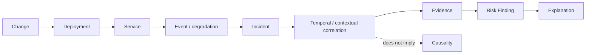
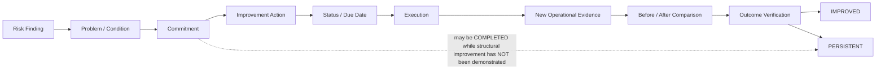

# VECTOR — Capability Map

## 1. Document Status

- Status: APPROVED SCOPE & CAPABILITIES
- Specification step: Step 2 — Scope & Capabilities
- SDD status: NOT_READY_FOR_IMPLEMENTATION
- Product Boundary status: ACCEPTED_FOR_DISCOVERY hypothesis; not a CLOSED domain-model decision
- Scope Quality Gate: CLOSED

This document materializes the approved Step 2 decisions. It defines product capabilities and scope classification only. It does not choose architecture, graph technology, database, frameworks, APIs, schemas, corporate systems, fields or permissions.

## 2. Capability Model

VECTOR Master Capability Map v1 contains 31 capabilities:

- Reliability Intelligence: 10 capabilities
- Execution Intelligence: 9 capabilities
- Intelligence Core: 12 capabilities

Each capability is described only by Purpose, Core Question, Expected Outcome and Depends On. Dependencies express capability relationships, not implementation choices.

### 2.1 Product Boundary Status

The three-area organization preserves the accepted Discovery hypothesis:

This does not promote the Product Boundary hypothesis to a CLOSED domain-model decision. DEC-003 remains `ACCEPTED_FOR_DISCOVERY`; formal validation belongs to Domain Modeling.

### 2.2 VECTOR Master Capability Map

```mermaid
flowchart TD
    V["VECTOR"]
    V --> RI["Reliability Intelligence"]
    V --> EI["Execution Intelligence"]
    V --> IC["Intelligence Core"]

    RI --> R01["R01 Service Reliability Intelligence"]
    RI --> R02["R02 Incident Intelligence"]
    RI --> R03["R03 Problem & Recurrence Intelligence"]
    RI --> R04["R04 Change Risk Intelligence"]
    RI --> R05["R05 Event Intelligence"]
    RI --> R06["R06 SLO / SLI Intelligence"]
    RI --> R07["R07 Operational & Technical Debt Intelligence"]
    RI --> R08["R08 Engineering Reliability Intelligence"]
    RI --> R09["R09 Resilience / DRP Intelligence"]
    RI --> R10["R10 Reliability Trend & Predictive Intelligence"]

    EI --> E01["E01 Area / Domain Performance Intelligence"]
    EI --> E02["E02 Commitment Intelligence"]
    EI --> E03["E03 Improvement & Outcome Intelligence"]
    EI --> E04["E04 Capacity & Allocation Intelligence"]
    EI --> E05["E05 Delivery Quality Intelligence"]
    EI --> E06["E06 Improvement Portfolio Intelligence"]
    EI --> E07["E07 Operating Model & Intervention Intelligence"]
    EI --> E08["E08 Technology Outcome Intelligence"]
    EI --> E09["E09 Individual Performance Intelligence"]

    IC --> C01["C01 Canonical Technology Context"]
    IC --> C02["C02 Evidence, Provenance & Source Authority"]
    IC --> C03["C03 Cross-Source Correlation"]
    IC --> C04["C04 Relationship / Service Graph"]
    IC --> C05["C05 Metric & KPI Intelligence"]
    IC --> C06["C06 Risk & Finding Intelligence"]
    IC --> C07["C07 Explainability"]
    IC --> C08["C08 Data Confidence"]
    IC --> C09["C09 Trend & Historical Analysis"]
    IC --> C10["C10 Decision Intelligence"]
    IC --> C11["C11 AI-Assisted Intelligence"]
    IC --> C12["C12 Audit & Traceability"]
```

## 3. Reliability Intelligence Capabilities

### R01 — Service Reliability Intelligence

- Purpose: Understand the reliability state and operational condition of technology services.
- Core Question: Where is a service reliable, degrading or exposed to risk?
- Expected Outcome: A service-level reliability view grounded in Evidence, context and history.
- Depends On: C01 Canonical Technology Context; C02 Evidence, Provenance & Source Authority; C05 Metric & KPI Intelligence; C09 Trend & Historical Analysis.

### R02 — Incident Intelligence

- Purpose: Understand incidents, their impact, context and relationships to services and other Evidence.
- Core Question: What happened, where did it affect the technology system, and what evidence supports the finding?
- Expected Outcome: An explainable incident view connected to affected services, conditions and Evidence.
- Depends On: C01 Canonical Technology Context; C02 Evidence, Provenance & Source Authority; C03 Cross-Source Correlation; C07 Explainability.

### R03 — Problem & Recurrence Intelligence

- Purpose: Identify persistent problems, recurrence patterns and the difference between temporary and structural resolution.
- Core Question: Which problems recur or persist, and why?
- Expected Outcome: A traceable view of recurrence, persistence and structural resolution status.
- Depends On: R02 Incident Intelligence; C02 Evidence, Provenance & Source Authority; C03 Cross-Source Correlation; C09 Trend & Historical Analysis.

### R04 — Change Risk Intelligence

- Purpose: Relate Changes to operational risk and observed service conditions.
- Core Question: Is a Change associated with a degradation or increased operational risk?
- Expected Outcome: An evidence-supported change-risk association with explicit uncertainty about causality.
- Depends On: R01 Service Reliability Intelligence; R05 Event Intelligence; C03 Cross-Source Correlation; C06 Risk & Finding Intelligence; C07 Explainability.

### R05 — Event Intelligence

- Purpose: Interpret operational events as signals of service condition, degradation or risk.
- Core Question: Which events indicate a meaningful reliability condition or change in risk?
- Expected Outcome: Contextual event intelligence connected to services, Changes, incidents and Evidence.
- Depends On: C01 Canonical Technology Context; C02 Evidence, Provenance & Source Authority; C03 Cross-Source Correlation; C09 Trend & Historical Analysis.

### R06 — SLO / SLI Intelligence

- Purpose: Understand service-level objectives and indicators as evidence of reliability outcomes.
- Core Question: How is service performance evolving relative to its reliability objectives?
- Expected Outcome: An explainable SLO/SLI condition with context, trend and supporting Evidence.
- Depends On: R01 Service Reliability Intelligence; C02 Evidence, Provenance & Source Authority; C05 Metric & KPI Intelligence; C09 Trend & Historical Analysis.

### R07 — Operational & Technical Debt Intelligence

- Purpose: Identify operational and technical debt that persists or contributes to reliability risk.
- Core Question: Where is debt accumulating, persisting or affecting reliability?
- Expected Outcome: A traceable debt view connected to risk, services, findings and improvement needs.
- Depends On: R03 Problem & Recurrence Intelligence; R08 Engineering Reliability Intelligence; C03 Cross-Source Correlation; C09 Trend & Historical Analysis.

### R08 — Engineering Reliability Intelligence

- Purpose: Interpret engineering reliability Evidence in relation to technology and service risk.
- Core Question: Which engineering reliability conditions are relevant to operational risk or service outcomes?
- Expected Outcome: An explainable engineering reliability view preserving Evidence and Source Authority.
- Depends On: C02 Evidence, Provenance & Source Authority; C03 Cross-Source Correlation; C06 Risk & Finding Intelligence; C07 Explainability.

### R09 — Resilience / DRP Intelligence

- Purpose: Understand resilience and disaster-recovery readiness as contributors to technology reliability.
- Core Question: Where are resilience or DRP conditions insufficient for the relevant technology context?
- Expected Outcome: A traceable resilience view connected to services, risk and improvement needs.
- Depends On: C01 Canonical Technology Context; C02 Evidence, Provenance & Source Authority; C06 Risk & Finding Intelligence; C09 Trend & Historical Analysis.

### R10 — Reliability Trend & Predictive Intelligence

- Purpose: Identify longer-term reliability patterns and future risk hypotheses.
- Core Question: Which reliability conditions are likely to persist or worsen based on available Evidence?
- Expected Outcome: Explicitly qualified trend and predictive intelligence that remains traceable to Evidence.
- Depends On: R01 Service Reliability Intelligence; R03 Problem & Recurrence Intelligence; C06 Risk & Finding Intelligence; C09 Trend & Historical Analysis; C11 AI-Assisted Intelligence.

## 4. Execution Intelligence Capabilities

### E01 — Area / Domain Performance Intelligence

- Purpose: Evaluate technology areas and domains through evidence, context, trends and outcomes.
- Core Question: Where should Technology Leadership concentrate attention?
- Expected Outcome: A decision-oriented area/domain view with drill-down to conditions, Evidence and outcomes.
- Depends On: C01 Canonical Technology Context; C02 Evidence, Provenance & Source Authority; C05 Metric & KPI Intelligence; C07 Explainability; C10 Decision Intelligence.

### E02 — Commitment Intelligence

- Purpose: Understand relevant commitments, their status and their relationship to risks and improvements.
- Core Question: Which commitments address identified risks, and are they producing the expected progress?
- Expected Outcome: A traceable commitment view connected to actions, risks and outcomes.
- Depends On: C02 Evidence, Provenance & Source Authority; C03 Cross-Source Correlation; C06 Risk & Finding Intelligence; C10 Decision Intelligence.

### E03 — Improvement & Outcome Intelligence

- Purpose: Connect improvement actions to intended outcomes and verify structural, sustainable improvement.
- Core Question: Did the organization reduce the identified risk or condition through a durable improvement?
- Expected Outcome: Evidence-based verification of improvement, outcome and remaining risk.
- Depends On: R03 Problem & Recurrence Intelligence; E02 Commitment Intelligence; C03 Cross-Source Correlation; C07 Explainability; C09 Trend & Historical Analysis; C10 Decision Intelligence.

### E04 — Capacity & Allocation Intelligence

- Purpose: Understand capacity and allocation in relation to commitments, risks and outcomes.
- Core Question: How do capacity and allocation affect the ability to address relevant risks and commitments?
- Expected Outcome: Contextual capacity intelligence connected to decisions and outcomes.
- Depends On: E02 Commitment Intelligence; E03 Improvement & Outcome Intelligence; C01 Canonical Technology Context; C05 Metric & KPI Intelligence.

### E05 — Delivery Quality Intelligence

- Purpose: Understand the quality and sustainability of technology delivery outcomes.
- Core Question: Are delivery outcomes producing reliable and sustainable results?
- Expected Outcome: An evidence-based delivery quality view connected to reliability and improvement outcomes.
- Depends On: R01 Service Reliability Intelligence; E03 Improvement & Outcome Intelligence; C02 Evidence, Provenance & Source Authority; C09 Trend & Historical Analysis.

### E06 — Improvement Portfolio Intelligence

- Purpose: Understand the portfolio of improvement initiatives and its relationship to risk reduction and outcomes.
- Core Question: Which improvement initiatives should be prioritized based on risk, impact and expected outcome?
- Expected Outcome: A traceable improvement portfolio view supporting prioritization and verification.
- Depends On: E02 Commitment Intelligence; E03 Improvement & Outcome Intelligence; C06 Risk & Finding Intelligence; C10 Decision Intelligence.

### E07 — Operating Model & Intervention Intelligence

- Purpose: Understand operating-model conditions and intervention patterns that affect sustainable outcomes.
- Core Question: Which operating-model conditions or interventions influence risk and improvement outcomes?
- Expected Outcome: A contextual operating-model view that informs human-accountable decisions.
- Depends On: E01 Area / Domain Performance Intelligence; E03 Improvement & Outcome Intelligence; C01 Canonical Technology Context; C07 Explainability.

### E08 — Technology Outcome Intelligence

- Purpose: Evaluate technology outcomes across reliability, execution and improvement dimensions.
- Core Question: Are technology activities producing the intended service, risk and improvement outcomes?
- Expected Outcome: A cross-dimensional outcome view grounded in Evidence and trends.
- Depends On: R01 Service Reliability Intelligence; E03 Improvement & Outcome Intelligence; C05 Metric & KPI Intelligence; C09 Trend & Historical Analysis.

### E09 — Individual Performance Intelligence

- Purpose: Explore a future evidence-based individual performance or contribution capability after V1.
- Core Question: TBD in a separate future specification with its own evidence, context and governance model.
- Expected Outcome: POST-V1 candidate only; no V1 outcome is defined.
- Depends On: TBD; future specification must independently address Evidence, Context, Governance, Privacy, Access Control, Explainability, Human Review and Auditability.

## 5. Intelligence Core Capabilities

### C01 — Canonical Technology Context

- Purpose: Represent the shared technology context needed to interpret reliability and execution intelligence.
- Core Question: What technology service, area, domain or related context does the Evidence concern?
- Expected Outcome: A consistent context for correlation, drill-down and decision-oriented analysis.
- Depends On: None at capability-map level; formal domain boundaries remain TBD at Domain Modeling.

### C02 — Evidence, Provenance & Source Authority

- Purpose: Preserve Evidence, origin, provenance and the authoritative source for each relevant fact or measurement.
- Core Question: What Evidence supports this conclusion, where did it originate, and which source is authoritative?
- Expected Outcome: Traceable intelligence that does not silently replace Source Authority.
- Depends On: C01 Canonical Technology Context.

### C03 — Cross-Source Correlation

- Purpose: Relate relevant Evidence across reliability, operations and execution contexts.
- Core Question: Which Evidence items, conditions, actions and outcomes are related?
- Expected Outcome: Explainable relationships that support investigation and decision-making.
- Depends On: C01 Canonical Technology Context; C02 Evidence, Provenance & Source Authority.

### C04 — Relationship / Service Graph

- Purpose: Support reasoning over relationships among services, domains, dependencies, conditions, Evidence, actions and outcomes.
- Core Question: How are the relevant technology objects and conditions connected?
- Expected Outcome: Relationship-aware navigation and analysis.
- Depends On: C01 Canonical Technology Context; C03 Cross-Source Correlation.

### C05 — Metric & KPI Intelligence

- Purpose: Define and interpret decision-relevant measurements with context and Evidence.
- Core Question: What does this measurement mean, how is it evolving, and what Evidence supports it?
- Expected Outcome: Contextual indicators that support explanation and drill-down rather than raw activity aggregation.
- Depends On: C01 Canonical Technology Context; C02 Evidence, Provenance & Source Authority; C09 Trend & Historical Analysis.

### C06 — Risk & Finding Intelligence

- Purpose: Represent and explain identified risks, findings, severity, persistence and relevant conditions.
- Core Question: What risk or finding exists, how significant is it, and what Evidence supports it?
- Expected Outcome: Traceable risk and finding intelligence suitable for prioritization and action.
- Depends On: C02 Evidence, Provenance & Source Authority; C03 Cross-Source Correlation; C07 Explainability.

### C07 — Explainability

- Purpose: Make conclusions understandable through context, reasoning and supporting Evidence.
- Core Question: Why does VECTOR present this condition, indicator, priority or recommendation?
- Expected Outcome: Explanations with drill-down to relevant Evidence and limitations.
- Depends On: C02 Evidence, Provenance & Source Authority; C03 Cross-Source Correlation; C06 Risk & Finding Intelligence.

### C08 — Data Confidence

- Purpose: Express the confidence and limitations applicable to Evidence and derived intelligence.
- Core Question: How reliable and complete is the Evidence supporting this conclusion?
- Expected Outcome: Explicit confidence context without replacing Source Authority.
- Depends On: C02 Evidence, Provenance & Source Authority; C07 Explainability.

### C09 — Trend & Historical Analysis

- Purpose: Interpret persistence, evolution and historical change over time.
- Core Question: Is the condition improving, degrading, recurring or persisting?
- Expected Outcome: Time-aware intelligence that prioritizes trends over isolated snapshots.
- Depends On: C01 Canonical Technology Context; C02 Evidence, Provenance & Source Authority.

### C10 — Decision Intelligence

- Purpose: Connect explained conditions and priorities to human-accountable decisions, actions and outcomes.
- Core Question: What decision or action should be considered, and what outcome should be verified?
- Expected Outcome: Decision-oriented intelligence traceable from condition through action and outcome.
- Depends On: C06 Risk & Finding Intelligence; C07 Explainability; C09 Trend & Historical Analysis.

### C11 — AI-Assisted Intelligence

- Purpose: Assist analysis, explanation or investigation while remaining grounded in Evidence and human accountability.
- Core Question: How can assisted analysis help users understand or investigate a condition without replacing Evidence or accountability?
- Expected Outcome: Qualified assistance with traceability, limitations and human review.
- Depends On: C02 Evidence, Provenance & Source Authority; C07 Explainability; C08 Data Confidence.

### C12 — Audit & Traceability

- Purpose: Preserve traceability of relevant conclusions, actions, outcomes and supporting Evidence.
- Core Question: Can the path from Evidence to conclusion, action and outcome be reconstructed?
- Expected Outcome: Auditable product intelligence and decision history.
- Depends On: C02 Evidence, Provenance & Source Authority; C03 Cross-Source Correlation; C07 Explainability.

## 6. V1 Scope Classification

V1 implements minimum end-to-end slices of MUST capabilities. This means the smallest useful portion required to execute the approved Vertical Journeys from Data/Evidence through correlation, finding/explanation and decision/action/outcome where applicable. It does not mean exhaustive implementation of each capability.

### 6.1 V1 MUST — 18 capabilities

R01, R02, R03, R04, R05, R06, E01, E02, E03, C01, C02, C03, C04, C05, C06, C07, C09, C10.

### 6.2 V1 SHOULD — 7 capabilities

R07, R08, E05, E08, C08, C11, C12.

### 6.3 POST-V1 — 6 capabilities

R09, R10, E04, E06, E07, E09.

E09 Individual Performance Intelligence explicitly remains POST-V1 and is governed separately. POST-V1 capabilities remain part of the VECTOR Master Capability Map and are candidates for progressive specification.

### 6.4 Classification Reconciliation

| Classification | Count |
|---|---:|
| V1 MUST | 18 |
| V1 SHOULD | 7 |
| POST-V1 | 6 |
| Total | 31 |

Every capability appears exactly once in the classification above.

### 6.5 V1 Scope Relationship / Classification Overview

```mermaid
flowchart LR
    V1["VECTOR V1 Scope"]
    V1 --> MUST["V1 MUST — 18\nR01–R06, E01–E03\nC01–C07, C09–C10"]
    V1 --> SHOULD["V1 SHOULD — 7\nR07–R08, E05, E08\nC08, C11–C12"]
    V1 --> POST["POST-V1 — 6\nR09–R10, E04, E06–E07, E09"]
    POST --> E09["E09 Individual Performance Intelligence\nGoverned separately"]
```

## 7. V1 Vertical Journeys

### J01 — Persistent Reliability Risk

Question: Where does a persistent reliability condition exist and why?

Minimum useful slice: identify the condition, connect it to affected technology context and Evidence, explain persistence or recurrence, and provide actionable decision information.

### J02 — Change-Associated Degradation

Question: Is a recent Change associated with an operational degradation?

Minimum useful slice: relate Change, Deployment, Service, event or degradation, Incident and Evidence, explain the supported temporal/contextual association and provide actionable decision information.

Semantic rule: Correlation does not imply causation. VECTOR may expose temporal/contextual association supported by Evidence but must not claim causality unless separately supported.

### J03 — Structural Improvement Verification

Question: Did the organization structurally reduce the identified risk?

Minimum useful slice: connect Risk Finding to Problem / Condition, Commitment, Improvement Action, Status / Due Date, Execution, New Operational Evidence and Before / After Comparison, then verify the Outcome as IMPROVED or PERSISTENT.

Semantic rule: A Commitment may be COMPLETED while structural improvement has NOT been demonstrated. Example interpretation: "Action completed, but structural improvement has not been demonstrated."

### J04 — Area / Domain Decision View

Question: Where should Technology Leadership concentrate attention?

Minimum useful slice: provide Technology Leadership with an area/domain view prioritized by attention state, drill down to a selected Service and Persistent Reliability Risk, explain why through Evidence, and connect Actions / Commitments to Outcome.

### 7.1 Cross-Cutting Journey Rule

Every Journey must terminate in actionable information traceable to Evidence. No relevant conclusion may exist only as a score without explanation.

## 8. Capability-to-Journey Coverage Matrix

Legend: `X` = covered by the Journey; `-` = not required for the Journey's minimum useful slice.

| Capability | J01 | J02 | J03 | J04 | Scope |
|---|:---:|:---:|:---:|:---:|---|
| R01 Service Reliability Intelligence | X | X | X | X | MUST |
| R02 Incident Intelligence | X | X | X | X | MUST |
| R03 Problem & Recurrence Intelligence | X | - | X | X | MUST |
| R04 Change Risk Intelligence | - | X | X | X | MUST |
| R05 Event Intelligence | X | X | - | X | MUST |
| R06 SLO / SLI Intelligence | X | X | X | X | MUST |
| R07 Operational & Technical Debt Intelligence | - | - | - | - | SHOULD |
| R08 Engineering Reliability Intelligence | - | - | - | - | SHOULD |
| R09 Resilience / DRP Intelligence | - | - | - | - | POST-V1 |
| R10 Reliability Trend & Predictive Intelligence | - | - | - | - | POST-V1 |
| E01 Area / Domain Performance Intelligence | - | - | X | X | MUST |
| E02 Commitment Intelligence | - | - | X | X | MUST |
| E03 Improvement & Outcome Intelligence | - | - | X | X | MUST |
| E04 Capacity & Allocation Intelligence | - | - | - | - | POST-V1 |
| E05 Delivery Quality Intelligence | - | - | - | - | SHOULD |
| E06 Improvement Portfolio Intelligence | - | - | - | - | POST-V1 |
| E07 Operating Model & Intervention Intelligence | - | - | - | - | POST-V1 |
| E08 Technology Outcome Intelligence | - | - | - | - | SHOULD |
| E09 Individual Performance Intelligence | - | - | - | - | POST-V1 |
| C01 Canonical Technology Context | X | X | X | X | MUST |
| C02 Evidence, Provenance & Source Authority | X | X | X | X | MUST |
| C03 Cross-Source Correlation | X | X | X | X | MUST |
| C04 Relationship / Service Graph | X | X | X | X | MUST |
| C05 Metric & KPI Intelligence | X | X | X | X | MUST |
| C06 Risk & Finding Intelligence | X | X | X | X | MUST |
| C07 Explainability | X | X | X | X | MUST |
| C08 Data Confidence | - | - | - | - | SHOULD |
| C09 Trend & Historical Analysis | X | - | X | X | MUST |
| C10 Decision Intelligence | X | X | X | X | MUST |
| C11 AI-Assisted Intelligence | - | - | - | - | SHOULD |
| C12 Audit & Traceability | - | - | - | - | SHOULD |

### 8.1 Coverage Result

All 18 V1 MUST capabilities are covered by at least one Journey. Orphan V1 MUST capabilities: 0.

The matrix does not promote SHOULD capabilities to MUST or move POST-V1 capabilities into V1. Their presence in the Master Capability Map preserves product traceability.

## 9. Post-V1 Capability Register

| ID | Capability | Status | Scope guardrail |
|---|---|---|---|
| R09 | Resilience / DRP Intelligence | FUTURE / POST-V1 | Remains outside V1 scope. |
| R10 | Reliability Trend & Predictive Intelligence | FUTURE / POST-V1 | Remains outside V1 scope. |
| E04 | Capacity & Allocation Intelligence | FUTURE / POST-V1 | Remains outside V1 scope. |
| E06 | Improvement Portfolio Intelligence | FUTURE / POST-V1 | Remains outside V1 scope. |
| E07 | Operating Model & Intervention Intelligence | FUTURE / POST-V1 | Remains outside V1 scope. |
| E09 | Individual Performance Intelligence | FUTURE / POST-V1 | Governed separately; must not become V1 individual scoring or ranking. |

## 10. Scope Guardrails

- Do not promote the Product Boundary hypothesis; DEC-003 remains `ACCEPTED_FOR_DISCOVERY`.
- V1 scope is limited to the approved MUST and SHOULD classifications.
- V1 MUST capabilities are implemented as minimum useful end-to-end slices for the approved Journeys, not as exhaustive capability implementations.
- Every relevant Journey conclusion must be actionable, explainable and traceable to Evidence.
- Correlation does not imply causation, especially for J02.
- Source Authority and provenance remain preserved.
- Individual Performance Intelligence remains POST-V1 and cannot be inferred from raw activity metrics.
- No architecture, graph technology, database, framework, API, schema, corporate system, field or permission is defined here.
- Later-gate open questions remain unresolved unless directly closed by this Step 2 artifact.

## 11. Scope Quality Gate

Status: CLOSED

Step 2 — Scope & Capabilities is complete and materialized in this specification.

Quality checks:

- Master Capability Map: 31 capabilities.
- V1 MUST: 18 capabilities.
- V1 SHOULD: 7 capabilities.
- POST-V1: 6 capabilities.
- Every capability appears exactly once in scope classification.
- Every V1 MUST capability maps to at least one Journey.
- Orphan V1 MUST capabilities: 0.
- E09, R09 and R10 remain POST-V1.
- DEC-003 remains `ACCEPTED_FOR_DISCOVERY`.
- SDD status remains `NOT_READY_FOR_IMPLEMENTATION`.

This closure does not authorize implementation and does not close Domain, Functional, Data, Graph, Integrations, UX, Architecture, Security, NFR, AI, Acceptance, Plan, Tasks or Traceability gates.
