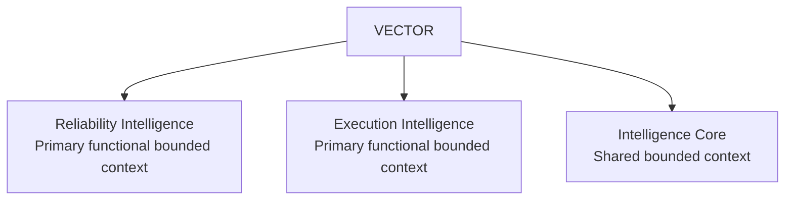
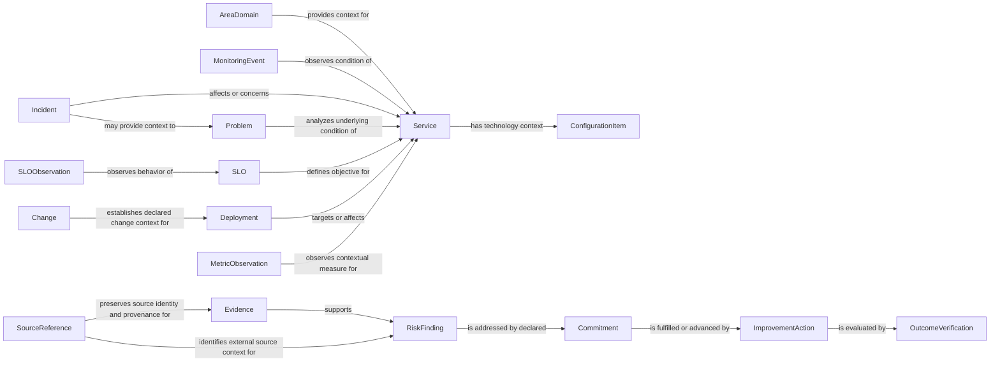
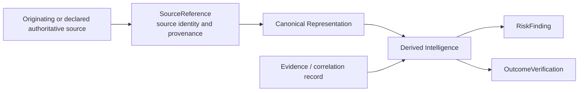
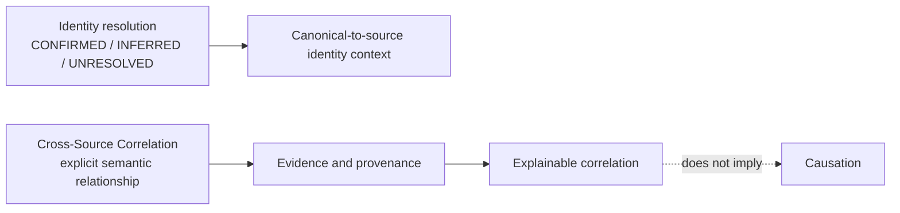

# VECTOR — Domain Model

## 1. Status

- Status: APPROVED PRODUCT BOUNDARY / DOMAIN MODEL
- Step: Step 3 — Product Boundary / Domain Model
- Quality Gate: PASSED
- SDD status: NOT_READY_FOR_IMPLEMENTATION
- SPEC-BLOCKERS: 0

This specification materializes DEC-030 through DEC-034. It is a semantic model only; it does not select deployment architecture, databases, graph technology, APIs, schemas, matching algorithms, confidence formulas, thresholds, or corporate mappings.

## 2. Product Boundary

VECTOR is one Technology Performance & Reliability Intelligence platform composed of Reliability Intelligence, Execution Intelligence, and Intelligence Core. Reliability Intelligence and Execution Intelligence are primary functional bounded contexts. Intelligence Core is the shared bounded context.

Bounded contexts define semantic ownership and product responsibilities. They do not imply separate deployable applications, microservices, databases, or physical architecture in V1.

## 3. Bounded Context Responsibilities

| Bounded Context | Semantic responsibility |
|---|---|
| Reliability Intelligence | Understanding technology reliability, operational health, degradation, recurrence, change-associated risk, events, and SLO/SLI behavior. |
| Execution Intelligence | Understanding commitments, improvement actions, and whether execution produces technology outcomes. |
| Intelligence Core | Shared Canonical Technology Context, Evidence, Provenance, Source Authority, Cross-Source Correlation, Relationship Graph, Metric/KPI Intelligence, Risk/Finding Intelligence, Explainability, historical context, and Decision Intelligence. |

## 4. Canonical Domain Model

VECTOR V1 has exactly 17 mandatory canonical entities. Canonical entities represent VECTOR semantics independently from vendor schemas. Service is the primary technology correlation anchor.

### 4.1 Core / Technology Context

| Entity | Semantic purpose |
|---|---|
| AreaDomain | Technology area or domain context for aggregation, semantic ownership, and decision-oriented drill-down. |
| Service | Primary technology correlation anchor connecting reliability, execution, Evidence, and technology context. |
| ConfigurationItem | Canonical technology-context representation relevant to a Service or reliability condition. |

### 4.2 Reliability

| Entity | Semantic purpose |
|---|---|
| MonitoringEvent | Observed operational signal relevant to a Service condition. |
| Incident | Operational disruption or degradation event requiring reliability understanding. |
| Problem | Persistent or recurrent underlying condition requiring analysis or structural resolution. |
| Change | Declared modification relevant to change-associated risk or operational context. |
| Deployment | Delivery-to-service operational context relevant to a Change or observed condition. |
| SLO | Service-level objective used to interpret reliability expectations. |
| SLOObservation | Observation of SLO/SLI behavior in relevant historical or operational context. |

### 4.3 Execution

| Entity | Semantic purpose |
|---|---|
| Commitment | Relevant declared commitment associated with risk, problem, action, or outcome; corporate Source Authority remains TBD when not natively created in VECTOR. |
| ImprovementAction | Action intended to address a condition, risk, problem, or Commitment. |
| OutcomeVerification | VECTOR-native/derived verification of whether an action or Commitment produced a demonstrated outcome. |

### 4.4 Intelligence Core

| Entity | Semantic purpose |
|---|---|
| Evidence | Supporting record or correlation record used to make conclusions traceable. |
| RiskFinding | VECTOR-native/derived intelligence artifact representing an explainable risk or finding. |
| MetricObservation | Contextual observation used by Metric/KPI Intelligence and historical analysis. |
| SourceReference | External source identity, source identifier, provenance, and authority context for a canonical representation or claim. |

Candidate extensions associated with non-MUST scope may include Repository, PullRequest, Branch, and SREAssessment. They are not part of the mandatory V1 canonical vocabulary. Person, Employee, ProductivityScore, and individual-performance entities are not canonical entities.

## 5. Conceptual Relationships

Relationships are semantic and explicit. They do not define cardinalities or storage technology.

- AreaDomain provides context for Service.
- Service anchors relevant MonitoringEvent, Incident, Problem, Change/Deployment, SLO/SLOObservation, MetricObservation, Evidence, RiskFinding, Commitment, ImprovementAction, and OutcomeVerification relationships.
- Incident may provide context for Problem; Problem may provide context for RiskFinding.
- Change and Deployment may be associated with Service conditions through explicit Evidence-backed correlation semantics.
- A RiskFinding is addressed by a declared Commitment; an ImprovementAction is concrete execution intended to fulfill or advance that Commitment; OutcomeVerification verifies whether execution produced the expected structural outcome.
- A Commitment represents the declared commitment to address a relevant risk, condition, or outcome. This semantic chain does not define workflow or state-machine behavior.
- EXT-001 Commitment responsibility is represented structurally as Commitment `ACCOUNTABLE_TO` exactly one existing AreaDomain. This does not infer organizational hierarchy, person/team ownership, or Source Authority; optional `responsibleParty` is descriptive/reference context only.
- Change, Deployment, Service, Incident, and degradation associations are temporal/contextual and Evidence-backed; they do not imply causation.
- SourceReference preserves external identity and provenance context for relevant canonical entities or claims; it does not define canonical identity.

## 6. Source Authority Model

VECTOR distinguishes Source Authority, Canonical Representation, and Derived Intelligence.

Canonicalization never transfers authority from an originating or declared authoritative source to VECTOR. Relevant external claims preserve provenance and source identity.

VECTOR is authoritative for native or derived artifacts it creates, including RiskFinding, OutcomeVerification, and VECTOR Evidence/correlation records. Authority may be entity-level or claim/attribute-level when needed. Unknown corporate authorities remain explicit TBD. Conflicting non-authoritative claims must not be silently resolved. VECTOR does not indiscriminately duplicate source systems.

## 7. Canonical and Source Identity

Canonical identity is independent from external source identifiers. External identities are represented through SourceReference.

| State | Meaning |
|---|---|
| CONFIRMED | Identity mapping is confirmed by available authoritative or approved Evidence. |
| INFERRED | Identity mapping is a non-confirmed inference and preserves mapping method, confidence, and Evidence/provenance. |
| UNRESOLVED | No identity mapping has been established. |

INFERRED identity must never be silently promoted to authoritative or CONFIRMED identity.

## 8. Identity, Correlation, and Causation

Identity and correlation are separate concepts. Relationships require explicit semantics rather than generic RELATED_TO-only semantics. Correlation must be explainable and Evidence-backed.

Correlation != Causation. Temporal/contextual association must never be silently promoted to causation.

## 9. TBDs and Deferred Decisions

- Exact matching algorithms, confidence formulas, and thresholds for identity resolution: TBD.
- Relationship cardinalities: TBD.
- Graph persistence technology: TBD.
- Corporate source authorities, identifiers, fields, APIs, mappings, and permissions: TBD.
- Commitment corporate Source Authority when not natively created in VECTOR: TBD.
- Source-conflict representation and precedence behavior: deferred to later Data / Integration specification.

## 10. Representability and Coverage Checks

| Check | Result |
|---|---|
| J01 Persistent Reliability Risk | Representable through AreaDomain, Service, MonitoringEvent, SLO/SLOObservation, Incident, Problem, Evidence, RiskFinding, and historical context. |
| J02 Change-Associated Degradation | Representable through Change, Deployment, Service, MonitoringEvent, Incident, Evidence, RiskFinding, and explainable temporal/contextual correlation. |
| J03 Structural Improvement Verification | Representable through RiskFinding, Problem, Commitment, ImprovementAction, Evidence, and OutcomeVerification. |
| J04 Area / Domain Decision View | Representable through AreaDomain, Service, RiskFinding, Evidence, Commitment, ImprovementAction, and OutcomeVerification. |
| 18 V1 MUST capabilities | See the explicit 18-row coverage matrix below. |
| Orphan MUST capabilities | 0. |
| Architecture technology selected | No. |
| SPEC-BLOCKERS | 0. |

### 10.1 V1 MUST Capability Coverage Matrix

| Capability | Bounded Context | Representability through canonical entities / semantics |
|---|---|---|
| R01 Service Reliability Intelligence | Reliability Intelligence | Service, MonitoringEvent, SLOObservation, Evidence, and historical context support service reliability understanding. |
| R02 Incident Intelligence | Reliability Intelligence | Service, Incident, MonitoringEvent, Evidence, and explicit incident-impact semantics support incident understanding. |
| R03 Problem & Recurrence Intelligence | Reliability Intelligence | Service, Incident, Problem, Evidence, and recurrence/persistence semantics support problem intelligence. |
| R04 Change Risk Intelligence | Reliability Intelligence | Change, Deployment, Service, RiskFinding, Evidence, and temporal/contextual association semantics support change-risk intelligence. |
| R05 Event Intelligence | Reliability Intelligence | MonitoringEvent, Service, Evidence, and operational-condition semantics support event intelligence. |
| R06 SLO / SLI Intelligence | Reliability Intelligence | Service, SLO, SLOObservation, MetricObservation, and historical context support SLO/SLI intelligence. |
| E01 Area / Domain Performance Intelligence | Execution Intelligence | AreaDomain, Service, RiskFinding, Evidence, and decision-oriented drill-down semantics support area/domain evaluation. |
| E02 Commitment Intelligence | Execution Intelligence | RiskFinding, Commitment, Evidence, and Source Authority semantics support commitment intelligence. |
| E03 Improvement & Outcome Intelligence | Execution Intelligence | Commitment, ImprovementAction, OutcomeVerification, Evidence, and structural-outcome semantics support improvement verification. |
| C01 Canonical Technology Context | Intelligence Core | AreaDomain, Service, and ConfigurationItem provide canonical technology context. |
| C02 Evidence, Provenance & Source Authority | Intelligence Core | Evidence and SourceReference preserve provenance, source identity, and Source Authority semantics. |
| C03 Cross-Source Correlation | Intelligence Core | SourceReference, Evidence, Service, and explicit relationship semantics support cross-source correlation. |
| C04 Relationship / Service Graph | Intelligence Core | Service-centered relationships among AreaDomain, ConfigurationItem, events, incidents, changes, and outcomes are explicitly semantic without selecting graph technology. |
| C05 Metric & KPI Intelligence | Intelligence Core | MetricObservation, SLO, SLOObservation, Service, and contextual measurement semantics support metrics and KPIs. |
| C06 Risk & Finding Intelligence | Intelligence Core | RiskFinding, Evidence, Problem, Service, and explicit risk semantics support finding intelligence. |
| C07 Explainability | Intelligence Core | Evidence, SourceReference, RiskFinding, and explicit relationship semantics support explainable conclusions. |
| C09 Trend & Historical Analysis | Intelligence Core | SLOObservation, Incident, Problem, Evidence, OutcomeVerification, and historical context support trend analysis. |
| C10 Decision Intelligence | Intelligence Core | AreaDomain, Service, RiskFinding, Commitment, ImprovementAction, OutcomeVerification, and decision semantics support decision intelligence. |

Coverage result: 18 MUST capabilities covered; orphan MUST capabilities: 0.

## 11. Step 3 Quality Gate

Status: PASSED

The Product Boundary is resolved, the 17-entity V1 canonical vocabulary is defined, source authority and cross-source identity/correlation semantics are explicit, J01–J04 are representable, and all 18 V1 MUST capabilities are supported. This does not authorize implementation. SDD status remains NOT_READY_FOR_IMPLEMENTATION.
