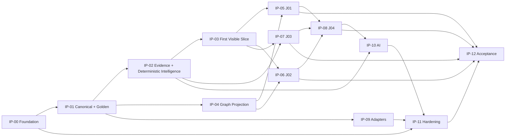

# VECTOR — Implementation Plan

## 1. Status and boundary

- Status: CLOSED / FINAL EXTERNAL QUALITY GATE PASSED
- Step: Step 13 — Implementation Plan
- SDD status: READY_FOR_IMPLEMENTATION
- SPEC-BLOCKERS: 0

This plan governs authorized implementation after `SDD_STATUS = READY_FOR_IMPLEMENTATION`. This closure creates no source code, infrastructure, runtime, or external integration. Steps 0–12 are closed inputs and are not redefined.

## 2. Incremental vertical implementation sequence

| IP | Objective and value | Dependencies / contracts consumed | Future outputs and acceptance | Sequencing / TBDs |
|---|---|---|---|---|
| IP-00 Engineering Foundation | Reproducible local engineering foundation. | Steps 9–12; NFR/SEC/OBS/RES. | React/TypeScript SPA, Java 21/Spring Boot modular-monolith skeleton, SQLite/Neo4j local runtime, config/test/telemetry foundations. | Sequential first. Physical tooling is implementation decision. |
| IP-01 Golden Dataset + Canonical Core | Make canonical semantics executable with deterministic local data. | 17 entities, data contracts, GS/AT. | Golden Dataset, canonical contracts, SQLite adapter, repositories, seed/oracle harness. | After IP-00; no corporate source required. |
| IP-02 Evidence + Deterministic Intelligence | Produce validated Evidence, MetricObservation and RiskFinding without AI. | Functional/data/graph semantics, deterministic oracle. | Deterministic processing and explainable intelligence paths. | After IP-01; AI excluded. |
| IP-03 First Visible Product Slice | First demonstrable value: Overview → Area/Domain → Service → RiskFinding → Evidence using canonical data. | Step 8/9.5 UX, BFF boundary, IP-01/02. | BFF projections and SPA path with evidence/provenance/limits. | Earliest demonstrable milestone. |
| IP-04 Graph Investigation | Add bounded graph inquiry without making graph canonical truth. | GRC-01..18, outbox/projector, IP-01/02. | SQLite outbox, async projector, Neo4j projection, GraphQueryService, bounded graph UX. | Graph failure remains degradable. |
| IP-05 Persistent Reliability Journey | Complete J01 end-to-end. | IP-03/04; R01–R06 and Evidence. | Persistent-risk UX, deterministic/semantic tests, GS-02/07/08/11. | May overlap graph read work once contracts stable. |
| IP-06 Change-Associated Degradation | Complete J02 without causal attribution. | IP-03/04; R04/C03/C04; identity rules. | Association, correlation limits, inferred/unresolved handling. | After Service/RiskFinding path. |
| IP-07 Structural Improvement | Complete J03 execution-to-outcome chain. | IP-02/03; E02/E03; OutcomeVerification semantics. | Commitment/action/outcome for IMPROVED, PERSISTENT, not-verifiable. | After deterministic Evidence/outcome logic. |
| IP-08 Leadership Decision Journey | Complete J04 end-to-end. | IP-03/05/06/07; UXI-01..15. | Context-retained leadership drill-down. | Integrates completed verticals. |
| IP-09 Integration Adapters | Add source adapters safely after fixtures. | Step 7, ports/ACL, provenance/authority, IP-01/02. | Fixtures/mocks first; sandbox later; ServiceNow PDI, ARIA Events→MonitoringEvent, SRE Skill provider, observability/SCM ports, VECTOR-native commitments where applicable. | Corporate selection TBD/non-blocking. |
| IP-10 AI-Assisted Investigation | Add AI-12..17 only over deterministic intelligence. | Step 11, security, IP-02/03/05–08. | AIProvider, bounded authorized context, structured output/provenance, graceful degradation. | Strictly after deterministic paths. |
| IP-11 Security / Resilience / Observability Hardening | Apply Step 10 requirements across completed slices. | Step 10, IP-00–10. | Authorization, configuration, telemetry, failure isolation, recovery. | Incremental from IP-00; release evidence precedes IP-12. |
| IP-12 Acceptance / Performance / Release Readiness | Execute Step 12 acceptance evidence. | AT-01..21, GS-01..12, all slices. | Golden, semantic/security/AI negatives, BASELINE, resilience, STRESS characterization. | Last integration gate; STRESS not corporate commitment. |

## 3. Implementation dependency DAG

The graph is acyclic. IP-11 starts incrementally with IP-00 but its cross-slice release evidence precedes IP-12 completion. The earliest demonstrable VECTOR milestone is IP-03: evidence-backed Technology Overview → Area/Domain → Service → RiskFinding → Evidence using local canonical data.

## 4. Cross-cutting rules and Definition of Done

- All 17 entities remain normative even when implementation is incremental. Neo4j is rebuildable projection/read model, never canonical Source of Truth; canonical commits survive graph failure.
- SPA communicates only with BFF REST HTTP/JSON. BFF does not own vendor logic; integration ports/adapters isolate provider models.
- Each slice preserves Evidence First, Source Authority, provenance, `Identity != Correlation`, `Correlation != Causation`, no silent conflict resolution, missing evidence != healthy, execution != outcome, and graceful partial intelligence.
- Security/NFR/observability are built with each slice. AI is authorized, bounded, provider-abstracted, deterministic-downstream, and unable to expand permissions.

Every IP is done only when consumed SDD contracts are implemented without drift; planned acceptance/negative tests pass; relevant observability/security/configuration obligations are met; limitations are visible; no corporate TBD becomes fact; and dependency/acceptance evidence links to implementation tasks/results.

## 5. Blocking and non-blocking TBDs

Corporate load, concurrency, topology, IAM, secret manager, AI provider/model, ARIA completeness, SRE provider, SCM source, and Commitment authority OQ-009 are non-blocking for local V1 where canonical contracts, fixtures/mocks, sandbox-compatible adapters, and acceptance exist. They remain explicit TBDs. A decision missing such that it forces invention of closed behavior is a SPEC-BLOCKER; none is identified.

## 6. Step 13 internal quality result

Final external Quality Gate result: PASS. All 18 MUST capabilities and J01–J04 have incremental implementation paths; acceptance attaches to the sequence; AI follows deterministic intelligence; graph remains projection; and security/NFR/observability are embedded. Step 13 is CLOSED; implementation follows this plan only through Ready tasks.

## 7. EXT-002 V1.1 controlled extension plan

EXT-002 is a governed post-V1 extension. It preserves the closed V1 plan and
adds no canonical entity, GRC, corporate authority, or Evolution capability.
The executable local sequence is:

| Task | Objective | Dependencies | Acceptance |
|---|---|---|---|
| TASK-EXT002-NAV | Durable navigation, deep links, and context restoration | BFF-001, UX-001 | UXI-01..15 context continuity |
| TASK-EXT002-GRAPH | Seeded bounded graph runtime through BFF | NAV, GRP-002 | GS-11 bounded/stale graph |
| TASK-EXT002-PANORAMA | Panorama Ejecutivo experience | NAV | executive attention and drill-down |
| TASK-EXT002-AREA | Area Intelligence experience | NAV, PANORAMA | AreaDomain → Service → Risk → Evidence |
| TASK-EXT002-COMMITMENT | Commitments & Improvements experience | AREA, EXT-001 | EXT-001 FR-EXT-001..007 |
| TASK-EXT002-SERVICE | Service Intelligence experience | NAV, AREA | service context and evidence |
| TASK-EXT002-RISK | Risk Investigation experience | GRAPH, SERVICE | bounded Evidence/Timeline/Graph |
| TASK-EXT002-J02 | J02 Change/Deployment experience | SERVICE, RISK | contextual correlation, never causation |
| TASK-EXT002-PERF | Mixed workload and STRESS characterization | NAV, GRAPH, J02 | existing NFR local profiles |
| TASK-EXT002-OUTBOX | Projection/outbox restart hardening | GRAPH | approved architecture and recovery |
| TASK-EXT002-GOV | Governed stale-state documentation cleanup | existing evidence | no silent OQ resolution |

The DAG is acyclic. Corporate IAM, corporate source mappings, and external
Commitment authority remain external dependencies and are not implementation
tasks in EXT-002. The Product Evolution tracker is governance-only.
