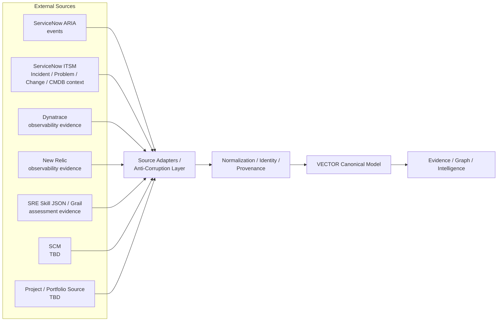

# VECTOR — Integration Specification

## 1. Status

- Status: CLOSED / EXTERNAL QUALITY GATE PASSED
- Step: Step 7 — Integration Specification
- External Quality Gate: PASS
- SDD status: NOT_READY_FOR_IMPLEMENTATION
- SPEC-BLOCKERS: 0

This specification defines the semantic contracts required to bring external context into VECTOR for a functional local V1 and later corporate portability. It does not define implementation, endpoints, APIs, credentials, schemas, polling, streaming, middleware, persistence, or corporate source precedence.

## 2. Purpose and Scope

VECTOR consumes external operational, observability, engineering, and execution context through contracts that preserve the vendor-independent Canonical Model. A source integration supplies available context; it does not automatically establish Source Authority for every related claim.

The local V1 may use realistic synthetic, non-sensitive, contract-compatible mock or fixture data. Corporate connectivity, mappings, authority applicability, and identity mappings remain `TBD` unless confirmed by later authoritative evidence.

## 3. CLOSED Integration Principles

### I1 — Adapter / Anti-Corruption Layer

External source models must not become VECTOR's Canonical Model. A Source Adapter translates source-specific objects and vocabulary through normalization and mapping into canonical entities, claims, Evidence, and SourceReference context. Vendor-specific identifiers, fields, states, and semantics remain outside the canonical boundary.

### I2 — Explicit Source Authority

Integration != Source Authority. Every contract identifies the supplied source, external object/data class, canonical mapping or claim, known authority scope/status, provenance, freshness semantics, and conflict behavior. Unknown corporate authority is `TBD`; VECTOR does not infer it. DEC-033 and DEC-035 remain governing semantics.

### I3 — Integration Maturity Model

| Level | Meaning |
|---|---|
| L0 CONTRACT_DEFINED | A contract exists but no working data source exists. |
| L1 MOCK | A contract-compatible mock or synthetic integration exists. |
| L2 SANDBOX | A real sandbox, developer, or test environment is used where available. |
| L3 CORPORATE_READ_ONLY | Corporate read-only connectivity exists. |
| L4 CORPORATE_VERIFIED | Corporate mappings, identity, authority, and behavior are verified. |
| L5 PRODUCTION | A production integration is approved and operating. |

No current L3–L5 corporate access is implied by this specification.

### I4 — External Integrations Read-Only by Default in V1

The default V1 direction is `EXTERNAL SOURCE → VECTOR`. V1 does not close an Incident, modify a Problem, approve or change a Change, alter CMDB, mutate Dynatrace/New Relic data, or mutate external project/portfolio systems. VECTOR-native entity creation or update inside VECTOR's own boundary is not external write-back. Any external write-back requires a later explicit decision.

### I5 — Graceful Partial Integration

Unavailable, stale, partial, incomplete, missing, or unresolved source context degrades intelligence explicitly rather than failing the product. Where applicable, VECTOR represents Source Coverage, Data Confidence, Freshness, Missing Context, and Uncertainty. Absence of Evidence is never Evidence of absence.

## 4. Integration Architecture

This is a conceptual semantic boundary, not a physical deployment, middleware, broker, database, or network design.

## 5. Minimum Integration Contract

Each `INT-*` contract records:

1. Integration ID and Source System.
2. Integration Purpose and External Data/Object Class.
3. Canonical Entity / Claim Mapping.
4. Direction.
5. Source Authority Status.
6. Provenance Requirements.
7. Freshness Semantics.
8. Identity Mapping / Resolution.
9. Conflict Behavior.
10. Failure / Degradation Behavior.
11. Maturity Level.
12. Local V1 Strategy.
13. Corporate Target Strategy.
14. Security / credential status.
15. Open Questions / TBDs.
16. Journey Support.
17. Capability Support.
18. Explicit Non-Goals.

All contracts use the default direction `EXTERNAL SOURCE → VECTOR`, unless a record is created natively within VECTOR. Canonical identity remains distinct from source identity; SourceReference preserves the external identity, provenance, and authority context.

## 6. Source Inventory

| Integration | Source System | Known purpose | Local V1 target | Corporate status |
|---|---|---|---|---|
| INT-01 | ServiceNow ARIA | Event-oriented operational source | L1 mock; L2 PDI only where feasible | Instance, API, table, mapping, and authority `TBD` |
| INT-02 | ServiceNow ITSM | Incident, Problem, Change, and CMDB / ConfigurationItem context | L1 mock; L2 PDI only where feasible | Schema, API, authority, and precedence `TBD` |
| INT-03 | Dynatrace | Observability / operational telemetry Evidence | L1 mock unless an accessible sandbox exists | API, Grail schema, tenant, endpoint, auth `TBD` |
| INT-04 | SRE Skill JSON / Grail | SRE Skill v2.1 assessment Evidence | L1 local fixture / contract-compatible JSON | Assessment authority applicability and corporate access `TBD` |
| INT-05 | New Relic | Observability Evidence | L1 mock unless an accessible sandbox exists | API, account, entity mapping `TBD` |
| INT-06 | SCM | Engineering/change/deployment context where applicable | L1 mock / fixture | Corporate SCM source `TBD` |
| INT-07 | Project / Portfolio Source | Execution context where applicable | L1 mock / fixture | Corporate source `TBD` |
| INT-08 | DRP Source | Future resilience context | POST-V1; not required locally | Source `TBD` |
| INT-09 | VECTOR-Native | Native / derived VECTOR entities | Local VECTOR-native records | Applies only within VECTOR boundary |
| INT-10 | Commitment | Commitment ownership/source context | L1 native-compatible mock / fixture | Ownership and external authority `TBD` (OQ-009 OPEN) |

## 7. Detailed Integration Contracts

### INT-01 — ServiceNow ARIA Events

- **Purpose / external class:** Event-oriented operational records.
- **Canonical mapping:** MonitoringEvent; available Service context; Evidence and SourceReference.
- **Direction / authority:** `EXTERNAL SOURCE → VECTOR`; producing-source authority for supplied event claims only when known, otherwise `TBD`.
- **Provenance, freshness, identity:** Preserve SourceReference, extraction/observation context, and `CURRENT`, `STALE`, or `UNKNOWN` freshness. Map toward canonical identities only as `CONFIRMED`, `INFERRED`, or `UNRESOLVED`; matching method is `TBD`.
- **Conflict / degradation:** Preserve conflicting event claims; unavailable, stale, partial, missing, or unresolved context is explicit and limits confidence rather than asserting healthy operation.
- **Maturity / strategies:** Local V1 L1 mock; L2 PDI where feasible, without treating PDI as corporate proof. Corporate strategy is a later read-only adapter after instance, mapping, authority, and identity verification.
- **Security / open questions:** No credentials in repository; non-sensitive sandbox data only. Corporate endpoint, API, table, mapping, access, and authority are `TBD` (OQ-010).
- **Journey / capability support:** J01, J02, J04; R01, R05, C02, C03, C07, C09.
- **Non-goals:** No source mutation, causal attribution, or event-schema definition.

### INT-02 — ServiceNow ITSM Context

- **Purpose / external class:** Incident, Problem, Change, and CMDB / ConfigurationItem context.
- **Canonical mapping:** Incident, Problem, Change, ConfigurationItem, Service context, Evidence, and SourceReference.
- **Direction / authority:** `EXTERNAL SOURCE → VECTOR`; source authority for any supplied claim is retained when known; universal ServiceNow authority and corporate precedence are `TBD`.
- **Provenance, freshness, identity:** Preserve source identity, claim context, extraction/observation context, and freshness. Canonical mapping uses only `CONFIRMED`, `INFERRED`, or `UNRESOLVED`; no matching algorithm is defined.
- **Conflict / degradation:** DEC-035 applies: preserve conflicts and represent unresolved when no applicable authority rule exists. Missing Problem or ConfigurationItem context does not prevent applicable partial journeys.
- **Maturity / strategies:** Local V1 L1 mock; L2 PDI where feasible for contract exploration with synthetic records. Corporate strategy is a later read-only adapter after schema, mappings, authority, identity, and behavior are verified.
- **Security / open questions:** No credentials in repository; corporate instance, schema, API, ACLs, permissions, mappings, and precedence are `TBD` (OQ-011).
- **Journey / capability support:** J01–J04; R02, R03, R04, C01, C02, C03, C04, C06, C07, C09.
- **Non-goals:** No Incident closure, Problem modification, Change approval/change, CMDB alteration, workflow design, or causation claim.

### INT-03 — Dynatrace Observability Evidence

- **Purpose / external class:** Observability and operational telemetry Evidence; SLO/measurement context where supplied.
- **Canonical mapping:** MonitoringEvent, SLO, SLOObservation, MetricObservation, Service context, Evidence, and SourceReference.
- **Direction / authority:** `EXTERNAL SOURCE → VECTOR`; measurement-source authority is retained per supplied claim when known, otherwise `TBD`.
- **Provenance, freshness, identity:** Preserve SourceReference, observed/extraction context, availability limitations, and freshness. Source-to-canonical identity remains `CONFIRMED`, `INFERRED`, or `UNRESOLVED`.
- **Conflict / degradation:** Overlap or conflict with another source is preserved, never silently selected. Unavailable telemetry reduces coverage/confidence and may yield limited or insufficient verification, not a fabricated result.
- **Maturity / strategies:** Local V1 L1 contract-compatible mock unless a real accessible sandbox is confirmed. Corporate strategy is a later read-only adapter after corporate access, mapping, and authority verification.
- **Security / open questions:** Tenant, endpoint, API, Grail schema, and authentication are `TBD`; no credentials or sensitive data enter the repository (OQ-012).
- **Journey / capability support:** J01–J04; R01, R05, R06, C02, C03, C05, C07, C09.
- **Non-goals:** No source mutation, telemetry schema, scoring formula, or causal attribution.

### INT-04 — SRE Skill JSON / Grail Assessment Evidence

- **Purpose / external class:** SRE Skill v2.1 JSON assessment Evidence, including available contextual assessment claims.
- **Canonical mapping:** Evidence and SourceReference; available Service, RiskFinding context, or MetricObservation only when semantically mapped without adding a new canonical entity.
- **Direction / authority:** `EXTERNAL SOURCE → VECTOR`; incremental/non-authoritative by default. A full assessment may be authoritative only within its own assessment process if prior authoritative evidence confirms that scope; otherwise authority is `TBD`.
- **Provenance, freshness, identity:** Preserve assessment origin, version/context when supplied, freshness, limitations, and SourceReference. Identity remains `CONFIRMED`, `INFERRED`, or `UNRESOLVED`.
- **Conflict / degradation:** Assessment claims coexist with conflicting claims; no automatic winner. Missing or partial assessment context limits intelligence explicitly.
- **Maturity / strategies:** Local V1 L1 local fixture / contract-compatible JSON. Corporate strategy is a later read-only adapter after access, schema, mapping, and authority applicability are verified.
- **Security / open questions:** Corporate Grail access, schema, endpoint, and authority scope are `TBD`; no sensitive assessment data in local fixtures (OQ-012).
- **Journey / capability support:** J01, J03, J04; C02, C03, C06, C07, C09.
- **Non-goals:** No individual productivity scoring, new SREAssessment canonical entity, or authority transfer to VECTOR.

### INT-05 — New Relic Observability Evidence

- **Purpose / external class:** Observability Evidence and available operational/measurement context.
- **Canonical mapping:** MonitoringEvent, SLOObservation, MetricObservation, Service context, Evidence, and SourceReference.
- **Direction / authority:** `EXTERNAL SOURCE → VECTOR`; authority is retained per supplied claim when known; role relative to Dynatrace and precedence are `TBD`.
- **Provenance, freshness, identity:** Preserve source identity, observed/extraction context, freshness, limitations, and identity resolution state.
- **Conflict / degradation:** Preserve overlap/conflict with other observability sources under DEC-035. Source absence does not assert normal operation.
- **Maturity / strategies:** Local V1 L1 contract-compatible mock unless an accessible sandbox is confirmed. Corporate strategy is a later read-only adapter after account, mapping, access, and authority verification.
- **Security / open questions:** API, account, entity mapping, permissions, and precedence are `TBD` (OQ-013); no credentials in repository.
- **Journey / capability support:** J01–J04 where available; R01, R05, R06, C02, C03, C05, C07, C09.
- **Non-goals:** No source mutation, corporate-source selection, or causation claim.

### INT-06 — SCM Context

- **Purpose / external class:** Engineering, change, and deployment context where applicable.
- **Canonical mapping:** Available Change, Deployment, Service context, Evidence, and SourceReference; Repository, PullRequest, and Branch remain non-MUST candidate extensions and are not required mappings.
- **Direction / authority:** `EXTERNAL SOURCE → VECTOR`; corporate SCM and authority scope are `TBD`.
- **Provenance, freshness, identity:** Preserve SourceReference and source identity; resolve canonical identity only as `CONFIRMED`, `INFERRED`, or `UNRESOLVED`.
- **Conflict / degradation:** Missing SCM context permits J02 to remain limited; temporal/contextual association remains Evidence-backed and never causal.
- **Maturity / strategies:** Local V1 L1 mock / fixture. Corporate strategy is a later read-only adapter after corporate SCM selection, mappings, identity, and authority verification.
- **Security / open questions:** SCM exact source, corporate access, endpoint, credential mechanism, and mappings are `TBD` (OQ-007).
- **Journey / capability support:** J02, J03, J04 where applicable; R04, C02, C03, C04, C07.
- **Non-goals:** No assumption of GitHub, source mutation, or addition of SCM entities to the V1 Canonical Model.

### INT-07 — Project / Portfolio Context

- **Purpose / external class:** Execution context where applicable.
- **Canonical mapping:** Available Commitment and ImprovementAction context, Evidence, and SourceReference; no project/portfolio entity is introduced.
- **Direction / authority:** `EXTERNAL SOURCE → VECTOR`; source and authority applicability are `TBD`. Project / Portfolio is not an authority for `OutcomeVerification`; any such authority remains VECTOR-native/derived within the approved boundary or `TBD` for external claims.
- **Provenance, freshness, identity:** Preserve source identity/provenance, freshness, limitations, and explicit identity-resolution state.
- **Conflict / degradation:** Missing project/portfolio context does not prevent local J03/J04 when a valid native-compatible mock/fixture supplies required Commitment/ImprovementAction context.
- **Maturity / strategies:** Local V1 L1 mock / fixture. Corporate strategy is a later read-only adapter after source, mapping, authority, and identity verification.
- **Security / open questions:** Corporate source, endpoint, access, credentials, and authority are `TBD` (OQ-005).
- **Journey / capability support:** J03, J04 where applicable; E02, E03, C02, C07, C10.
- **Non-goals:** No assumption of Jira, ServiceNow SPM, Azure DevOps, or other corporate source; no Project / Portfolio authority for `OutcomeVerification`; no external write-back.

### INT-08 — DRP Source

- **Purpose / external class:** Future resilience / disaster-recovery context.
- **Canonical mapping:** Potential future Evidence, SourceReference, and Service/RiskFinding context only if later approved.
- **Direction / authority:** `EXTERNAL SOURCE → VECTOR`; source and authority are `TBD`.
- **Provenance, freshness, identity:** Any future mapping must preserve provenance, freshness, and identity resolution.
- **Conflict / degradation:** Its absence does not affect V1 journey execution or imply resilience health.
- **Maturity / strategies:** POST-V1; no local V1 integration is required. Corporate strategy awaits source discovery and a later approved contract.
- **Security / open questions:** Source, access, mappings, and authority are `TBD` (OQ-006).
- **Journey / capability support:** None required for V1; R09 remains POST-V1.
- **Non-goals:** No V1 blocker, DRP source invention, or resilience claim.

### INT-09 — VECTOR-Native / Derived Context

- **Purpose / external class:** VECTOR-native and derived artifacts created inside the approved VECTOR boundary.
- **Canonical mapping:** RiskFinding and OutcomeVerification are VECTOR-derived/native; VECTOR-native Evidence/correlation records retain their defined derived context.
- **Direction / authority:** Internal VECTOR creation/update is not external write-back. VECTOR is authoritative for these native/derived artifacts, but not for external source facts that support them.
- **Provenance, freshness, identity:** Evidence and SourceReference preserve supporting external provenance; identity/correlation uncertainty remains explicit.
- **Conflict / degradation:** Derived intelligence remains limited or insufficient when supporting Evidence is missing, stale, partial, or unresolved.
- **Maturity / strategies:** Local V1 supports native/derived records using contract-compatible context. Corporate portability preserves the canonical model while replacing only external adapters and verified mappings.
- **Security / open questions:** No external credential is implied. Physical persistence, access control, and implementation are deferred.
- **Journey / capability support:** J01–J04; R01, R03, E03, C02, C03, C06, C07, C09, C10.
- **Non-goals:** No transfer of Source Authority from external sources to VECTOR and no external write-back.

### INT-10 — Commitment Context

- **Purpose / external class:** Commitment ownership, status, due-date, and action context when available.
- **Canonical mapping:** Commitment, ImprovementAction, Evidence, and SourceReference.
- **Direction / authority:** A VECTOR-native Commitment may be created inside VECTOR where prior specifications allow; external Commitment source authority remains `TBD`. OQ-009 remains OPEN.
- **Provenance, freshness, identity:** Preserve source/native origin, provenance, freshness, and `CONFIRMED`, `INFERRED`, or `UNRESOLVED` identity state.
- **Conflict / degradation:** Without an authority rule, preserve conflicting Commitment claims as unresolved. Missing external ownership does not prevent local J03/J04 using a VECTOR-native-compatible fixture; it must not be silently generalized to corporate authority.
- **Maturity / strategies:** Local V1 L1 native-compatible mock / fixture. Corporate strategy awaits OQ-009 evidence and verified source/authority applicability.
- **Security / open questions:** Corporate source, ownership model, authority, mapping, and access are `TBD` (OQ-009).
- **Journey / capability support:** J03, J04; E02, E03, C02, C07, C10.
- **Non-goals:** No universal VECTOR or corporate authority declaration, external write-back, or workflow/state-machine definition.

## 8. Identity and Correlation Rules

- Canonical Identity != Source Identity. SourceReference preserves source-native identity and provenance; it does not become canonical identity.
- Service remains the primary technology correlation anchor.
- Identity resolution is only `CONFIRMED`, `INFERRED`, or `UNRESOLVED`. `INFERRED` preserves uncertainty, provenance, Evidence, and applicable method/context without promotion to confirmed identity.
- Identity != Correlation. A contract may contribute Evidence-backed temporal/contextual correlation without defining matching algorithms, thresholds, scores, fuzzy logic, or promotion rules.
- Correlation != Causation. Change/deployment associations with degradation or Incident context remain temporal/contextual and Evidence-backed; no contract claims cause.

## 9. Source Authority and Conflict Rules

DEC-033 and DEC-035 apply to every contract. VECTOR preserves conflicting claims and their provenance. A canonical representation may select an explicitly authoritative claim only under an explicit applicable authority rule. Canonicalization never transfers Source Authority to VECTOR. Without sufficient authority or precedence, the conflict remains unresolved.

OQ-016 remains RESOLVED conceptually. Integration-specific authority applicability may remain `TBD`; no corporate authority precedence is defined here.

## 10. Freshness and Availability Semantics

Freshness is represented conceptually as `CURRENT`, `STALE`, or `UNKNOWN`, based on available source context; no numeric SLA, polling period, TTL, or latency target is defined.

The following conditions remain distinct:

| Condition | Required semantic treatment |
|---|---|
| Source unavailable | The source cannot currently provide context; unaffected intelligence may continue. |
| Source stale | Last known context may remain available with stale status and provenance. |
| Source partial | The source supplied incomplete context; coverage/confidence limitations are explicit. |
| Source missing | No applicable source context is available; it is not treated as a healthy state. |
| Mapping unresolved | A source record cannot yet map to a canonical entity/claim without invention. |
| Identity unresolved | Source-to-canonical identity remains `UNRESOLVED`; it is not silently merged. |

## 11. Graceful Degradation

An unavailable integration must not crash the whole product. VECTOR preserves last known provenance where appropriate, exposes missing/stale context, reduces confidence/coverage where appropriate, avoids fabricated certainty, and allows unaffected journeys/capabilities to continue where possible. Insufficient Evidence produces limited, inconclusive, or not-yet-verifiable intelligence as already defined by the functional and data specifications.

## 12. Local V1 Integration Strategy

| Source | Local strategy | V1 guardrail |
|---|---|---|
| ServiceNow ARIA | L1 mock; L2 PDI where feasible | PDI does not verify corporate facts. |
| ServiceNow ITSM | L1 mock; L2 PDI where feasible | Synthetic non-sensitive data only. |
| Dynatrace | L1 contract-compatible mock unless accessible sandbox is confirmed | No assumed tenant/API/auth. |
| SRE Skill JSON / Grail | L1 local fixture / contract-compatible JSON | Incremental/non-authoritative unless confirmed otherwise. |
| New Relic | L1 contract-compatible mock unless accessible sandbox is confirmed | No assumed account/API. |
| SCM | L1 mock / fixture | Corporate source remains `TBD`. |
| Project / Portfolio | L1 mock / fixture | Corporate source remains `TBD`. |
| DRP | POST-V1 / not required | Does not block V1. |
| VECTOR-Native | Native/derived local context | Preserves derived authority boundary. |
| Commitment | L1 native-compatible mock / fixture | Does not resolve OQ-009. |

No corporate secrets or internal production data are placed in a personal sandbox, PDI, or repository.

## 13. Corporate Portability Strategy

The portability pattern is `Mock/Sandbox Adapter → Corporate Adapter`. The Canonical Model and contracts remain stable; a corporate migration primarily replaces connectivity, authentication, source-specific mappings, verified authority, verified identity mappings, and operational NFR configuration. A canonical-model redesign is not implied unless authoritative new evidence creates a legitimate SPEC-BLOCKER.

## 14. Journey Integration Coverage Matrix

| Journey | Minimum local contract-compatible context | Partial-integration viability | Result |
|---|---|---|---|
| J01 Persistent Reliability Risk | Service, operational/observability, Incident/Problem/SLO, Evidence context via INT-01/02/03/04/05/09 | Missing Problem or ConfigurationItem remains explicit; mock evidence can support limited but explainable intelligence | PASS |
| J02 Change-Associated Degradation | Change/Deployment/Service plus operational Evidence via INT-02/03/05/06/09 | Source gaps limit association; temporal/contextual correlation remains Evidence-backed and non-causal | PASS |
| J03 Structural Improvement Verification | RiskFinding, Commitment, ImprovementAction, OutcomeVerification, and new operational Evidence via INT-02/03/04/05/09/10 | Commitment context may be native-compatible mock; insufficient evidence remains not yet verifiable | PASS |
| J04 Area / Domain Decision View | AreaDomain/Service/RiskFinding/Evidence/Action/Outcome context via INT-02/03/04/05/07/09/10 | Available context supports partial drill-down with limitations exposed | PASS |

No Journey requires every possible source. Each remains executable locally through an applicable L1/L2 strategy without inventing corporate authority.

## 15. Capability Coverage

The closed Capability-to-Journey mapping remains unchanged. The following integration coverage accounts for all 18 MUST capabilities without treating corporate unavailability as an orphan condition.

| MUST capability | Local integration support | Viability |
|---|---|---|
| R01 Service Reliability Intelligence | INT-01/02/03/05/09 | L1/L2 compatible |
| R02 Incident Intelligence | INT-02/09 | L1/L2 compatible |
| R03 Problem & Recurrence Intelligence | INT-02/09 | L1/L2 compatible |
| R04 Change Risk Intelligence | INT-02/03/05/06/09 | L1/L2 compatible |
| R05 Event Intelligence | INT-01/03/05 | L1/L2 compatible |
| R06 SLO / SLI Intelligence | INT-03/05 | L1 compatible |
| E01 Area / Domain Performance Intelligence | INT-02/03/04/05/09 | L1/L2 compatible |
| E02 Commitment Intelligence | INT-07/10 | L1 compatible; corporate ownership `TBD` |
| E03 Improvement & Outcome Intelligence | INT-03/04/05/09/10 | L1 compatible |
| C01 Canonical Technology Context | INT-02/06/09 | L1/L2 compatible |
| C02 Evidence, Provenance & Source Authority | INT-01–INT-10 where applicable | L1 compatible |
| C03 Cross-Source Correlation | INT-01/02/03/04/05/06/09 | L1 compatible, non-causal |
| C04 Relationship / Service Graph | INT-02/06/09 | L1 compatible; no graph technology selected |
| C05 Metric & KPI Intelligence | INT-03/05 | L1 compatible; no formula defined |
| C06 Risk & Finding Intelligence | INT-01/02/03/04/05/09 | L1 compatible |
| C07 Explainability | INT-01–INT-10 where applicable | L1 compatible |
| C09 Trend & Historical Analysis | INT-01/02/03/04/05/09 | L1 compatible |
| C10 Decision Intelligence | INT-02/03/04/05/07/09/10 | L1 compatible |

Coverage result: 18/18 MUST capabilities have a local L1/L2-compatible path. Orphan MUST capabilities: 0. DRP/R09 remains POST-V1 and is not a V1 integration blocker.

## 16. OQ-009 Treatment

OQ-009 remains OPEN. Locally, VECTOR may exercise a VECTOR-native-compatible Commitment fixture where prior specifications permit it, including its relationship to ImprovementAction and OutcomeVerification. Corporately, Commitment ownership and external Source Authority remain dependent on evidence identifying the authoritative source and applicable authority scope. That evidence is required to close OQ-009, but it is not required for the local V1 path described here.

## 17. Security Boundary

Step 7 records only these integration constraints:

- Credentials and secrets are not stored in the repository.
- Sandbox/local fixtures use non-sensitive data.
- Corporate authentication mechanism is `TBD` unless confirmed.
- External integrations are read-only by default.
- Least-privilege access is expected.
- Provenance is retained.

Detailed IAM, encryption, secret management, network security, certificate handling, threat modeling, and controls are deferred to Step 10.

## 18. Deferred Decisions

| Deferred decision | Target stage |
|---|---|
| Corporate endpoints, API versions, credentials/authentication, access, source schemas, and mappings | Corporate Integration Verification |
| Corporate authority applicability/precedence and corporate identity mappings | Corporate Integration Verification |
| Polling versus streaming, webhook/event strategy, retry behavior, rate limits, timeouts, and exact freshness thresholds | Step 9 Architecture / Step 10 Security-NFR |
| Queue/broker, middleware, physical canonical persistence, and implementation topology | Step 9 Architecture |
| Detailed security controls | Step 10 Security/NFR |
| Corporate SCM, Project/Portfolio, and DRP sources | Corporate Integration Verification |
| Commitment ownership/source authority (OQ-009) | Corporate Integration Verification / Corporate Source Authority evidence |
| External write-back | Later explicit decision |

## 19. Step 7 Quality Gate

Status: CLOSED / EXTERNAL QUALITY GATE PASSED.

Formal external Quality Gate result: PASS. I1–I5 are accepted; the anti-corruption layer, authority separation, read-only external V1 rule, maturity model, local V1 strategy, portability strategy, graceful degradation, source inventory, J01–J04 coverage, and 18 MUST local viability are explicit. SPEC-BLOCKERS: 0. OQ-009 remains OPEN and non-blocking for local V1; OQ-016 remains RESOLVED. No corporate source, endpoint, authority precedence, canonical entity, external write-back, or physical technology is invented. Step 7 is CLOSED; the next step is Step 8 — UX Specification.
