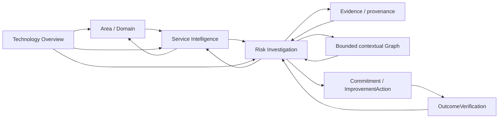

# VECTOR — Interaction Design & Prototype Specification

## 1. Status and boundary

- Status: CLOSED / EXTERNAL UX QUALITY GATE PASSED
- Step: Step 9.5 — Interaction Design & Prototype
- External UX Quality Gate: PASS
- SDD status: NOT_READY_FOR_IMPLEMENTATION
- SPEC-BLOCKERS: 0

This artifact operationalizes the closed Step 8 UX Specification after closed
Step 9 architecture. It is an interaction contract, wireflow, state model,
and prototype specification. It does not reopen Steps 0–9, define production
code, APIs, database schemas, visual styling, or a frontend state-management
technology.

Steps 0–9 remain CLOSED. Step 9.5 is required before Step 13 Implementation
Plan. Step 10 has not started.

## 2. UXI-01 — Investigative workspace model

VECTOR V1 is a progressive, decision-oriented investigative workspace, not a
CRUD navigator, collection of unrelated dashboards, isolated entity pages, or
a generic graph explorer. The primary experience is:

`ATTENTION → CONTEXT → EXPLANATION → EVIDENCE / ACTION / OUTCOME`

The primary progression is:

`Technology Overview → Area/Domain → Service → RiskFinding → Evidence / Action / Outcome`

The shared analytical context is Period, Area/Domain, Service, and RiskFinding.
Compatible context is preserved when moving to and from Evidence, graph
context, Commitment, ImprovementAction, and OutcomeVerification. Dependent
projections (trends, findings, evidence, actions, outcomes, and graph context)
must remain semantically coordinated; a view must not silently combine
incompatible analytical universes.

### UXI-02 — Context continuity

Users can investigate Evidence, graph context, actions, and outcomes and return
without manually reconstructing Period, Area/Domain, Service, or RiskFinding
context. No frontend state-management library is prescribed.

### UXI-03 — Attention-first overview

Technology Overview emphasizes concentration of attention/risk, persistent
reliability conditions, trends, change-associated degradation, explanation,
action, and outcome. Raw operational counts support explanation but do not
dominate the experience.

### UXI-04 — Coordinated analysis context

Changes to applicable shared context keep trends, RiskFindings, Evidence
summaries, actions, outcomes, and graph context semantically coordinated.

### UXI-05 — Progressive context narrowing

Investigation narrows Technology → Area/Domain → Service → RiskFinding →
Evidence/Action/Outcome, while compatible broader context remains available.

### UXI-06 — Risk investigation workspace

RiskFinding is the explainable entry point for answering what is happening,
why it is highlighted, what Evidence supports it, what operational context
exists, what is being done, and whether it worked.

No exact route, drawer, modal, screen count, visual treatment, or state library
is selected here.

## 3. Minimum prototype contract

The disposable/non-production prototype specification covers only three
navigable areas and uses clearly synthetic/demo-safe data:

1. **Technology Overview** — attention, persistence, trends,
   change-associated degradation, explanation, action, and outcome context.
2. **Service Intelligence** — Service-centered operational and Evidence
   context with bounded contextual graph.
3. **Risk Investigation** — What is happening, why it is highlighted, which
   Evidence supports it, what operational context exists, what is being done,
   and whether it worked.

Risk Investigation exposes navigable access to Evidence, contextual Graph,
Commitment/ImprovementAction, and OutcomeVerification. It is sufficient to
demonstrate J01–J04 without designing every possible screen.

The repository is in specification phase and `AGENTS.md` forbids production
application source. Therefore this step materializes the interaction
specification, wireflow/state model, and prototype contract; an executable
prototype requires an explicitly authorized exception or later phase.

## 4. UXI-07 — Evidence-first interaction

Decision-relevant claims navigate toward supporting Evidence where available,
preserving SourceReference, provenance, timestamps, freshness, authority
context, and confidence/uncertainty. Evidence is never invented.

## 5. UXI-08 — Bounded context graph

Graph starts as a bounded contextual subgraph around the investigated
Service/RiskFinding. It uses normative GRC semantics, preserves predicate
direction, keeps Service as the primary technology correlation anchor,
distinguishes contextual correlation from causation, and is not a generic
Neo4j Browser replacement.

## 6. UXI-09 — Progressive graph disclosure

Selecting a node first exposes explanatory/contextual information. Further
expansion is explicit, incremental, bounded, and user-controlled. Arbitrary
final depth/node limits remain implementation/NFR decisions.

## 7. UXI-10 — Semantic visual distinction

The experience distinguishes SOURCE/OBSERVED FACT, DERIVED INTELLIGENCE,
CORRELATION, UNCERTAINTY, and VERIFIED OUTCOME. Exact colors/icons remain
prototype/design work; correlation is never represented as proven causation.

## 8. UXI-11 — Data quality as experience

Source Coverage, Data Confidence, Freshness, Missing Context, and Uncertainty
are visible whenever they affect interpretation; incomplete data is not hidden
behind false precision.

## 9. UXI-12 — Graceful partial intelligence

Unavailable, stale, or incomplete sources do not necessarily block the whole
experience. Semantically valid available evidence remains usable, and absence
of evidence is not evidence of absence.

## 10. UXI-13 — Conflicting claims

Conflicting claims remain visible and inspectable through provenance,
freshness, and authority context; no winner is silently selected. DEC-035 is
preserved. An applicable explicit Source Authority may be presented while the
conflict remains traceable.

## 11. UXI-14 — Identity uncertainty

`CONFIRMED`, `INFERRED`, and `UNRESOLVED` remain visibly distinct. Inferred
identity is traceable to applicable mapping method, confidence, and Evidence;
unresolved identity never silently becomes confirmed. `Identity != Correlation`.

## 12. UXI-15 — Insufficient evidence

Insufficient Evidence is meaningful and explicit. No observed degradation does
not mean healthy, no incidents does not mean improvement, and completed action
does not mean improved outcome. OutcomeVerification retains `IMPROVED`,
`PERSISTENT`, and insufficient evidence/not-yet-verifiable semantics.

## 13. Wireflow and interaction rules

Interaction rules:

- Overview answers where attention is required, why, and what happened with
  actions; raw counts support explanation but do not dominate.
- Area/Domain provides grouping and the J04 decision path; it is not a source
  authority or causal owner.
- Service remains the primary technology correlation anchor.
- RiskFinding is the primary explainable investigation entry point.
- Decision-relevant derived claims navigate toward supporting Evidence where
  available, retaining SourceReference, provenance, timestamps, freshness,
  authority context, and uncertainty.
- Graph begins as a bounded contextual subgraph around the investigated
  Service/RiskFinding. Node selection reveals context; expansion is explicit,
  incremental, bounded, and user-controlled. GRC predicate direction and
  correlation-versus-causation distinction are preserved.
- The experience perceptibly distinguishes source/observed fact, derived
  intelligence, correlation, uncertainty, and verified outcome. Correlation is
  never presented as proven causation.
- Source Coverage, Data Confidence, Freshness, Missing Context, and Uncertainty
  are visible when they affect interpretation. Partial intelligence remains
  usable where semantically valid; absence of evidence is not evidence of
  absence.

## 14. Semantic state model

States are semantic presentation states, not physical enums or implementation
requirements:

| State | Required behavior |
|---|---|
| Loading | Identify requested context as loading; imply neither health nor completion. |
| No data | State that applicable context is unavailable; infer neither normal operation nor absence of risk. |
| Partial data | Show available context and Missing Context; allow supported partial navigation. |
| Stale data | Retain last-known context only with visible freshness limitation and provenance. |
| Conflicting claims | Preserve competing claims, provenance, freshness, authority context, and unresolved status; never silently choose. |
| Unresolved identity | Display `UNRESOLVED`; do not merge records or silently block unaffected context. |
| Inferred identity | Display `INFERRED`, with applicable mapping method, confidence, Evidence, and provenance; never as confirmed. |
| Insufficient evidence | Limit finding, correlation, or outcome to what Evidence supports. |
| No RiskFinding | Show available operational context without inventing a finding or attention conclusion. |
| RiskFinding without Commitment | Show explicit absence of Commitment; fabricate neither ownership nor action. |
| Commitment without completed ImprovementAction | Show commitment/action context and lack of completed action; do not assert execution. |
| ImprovementAction completed but outcome not yet verifiable | Preserve completion and state that structural improvement is not demonstrated. |
| `IMPROVED` | Present Evidence-backed OutcomeVerification with comparable context and limitations. |
| `PERSISTENT` | Present continued condition or insufficient structural improvement without blame or causal certainty. |

Identity is distinct from correlation. Identity states `CONFIRMED`, `INFERRED`,
and `UNRESOLVED` remain traceable and must not be silently promoted.

## 15. Journey interaction contracts

| Journey | Demonstration path | Gate evidence |
|---|---|---|
| J01 Persistent Reliability Risk | Overview attention → Area/Domain → Service → RiskFinding → Evidence | Persistence/recurrence, explanation, provenance, coverage/freshness, and limited-data behavior. |
| J02 Change-Associated Degradation | Service → Change/Deployment → before/during/after context → Evidence/correlation explanation | Temporal/contextual association is inspectable and explicitly not causation. |
| J03 Structural Improvement Verification | RiskFinding → Commitment → ImprovementAction → new Evidence → OutcomeVerification | Completion is distinct from `IMPROVED`; `PERSISTENT` and insufficient evidence remain valid outcomes. |
| J04 Area/Domain Decision View | Overview → Area/Domain → Service → RiskFinding → Evidence/action/outcome | Human-accountable attention and follow-up with shared context and visible limits. |

The journeys preserve the closed semantics of Steps 0–8 and do not introduce
new canonical entities, roles, rankings, or business/customer concepts.

## 16. Prototype scenarios and acceptance prompts

Synthetic scenarios must include at least:

- attention concentrated on a Service with persistent reliability Evidence;
- a Change/Deployment temporally associated with degradation, explicitly
  labelled correlation rather than causation;
- an unresolved or inferred identity and a conflicting claim whose provenance
  remains inspectable;
- partial/stale context where unaffected investigation continues;
- a RiskFinding with no Commitment;
- a Commitment with no completed ImprovementAction;
- a completed ImprovementAction with insufficient Evidence;
- `IMPROVED` and `PERSISTENT` OutcomeVerification paths;
- a bounded graph expansion around the Service/RiskFinding rather than a
  hairball or unrestricted Neo4j Browser experience.

The prototype must allow an evaluator to answer for each finding: what is
happening, why it is highlighted, what supports it, what operational context
exists, what is being done, and did it work.

## 17. Step 9.5 UX Quality Gate

Formal external Quality Gate result: PASS. The gate verified:

| Criterion | Verification question |
|---|---|
| A. Decision orientation | Can attention and its explanation be understood? |
| B. Context continuity | Can investigation continue without rebuilding context? |
| C. Explainability | Can the user understand why a RiskFinding is highlighted? |
| D. Evidence traceability | Can decision-relevant intelligence reach supporting Evidence? |
| E. Graph utility | Does bounded graph interaction help rather than create a hairball? |
| F. Semantic fidelity | Are fact, intelligence, correlation, uncertainty, and outcome distinct? |
| G. Partial intelligence | Are incomplete, stale, and conflicting data visible and safely usable? |
| H. Action/outcome | Can the user inspect action and determine whether an outcome is verifiable? |
| I. Journey coverage | Can J01–J04 be demonstrated? |
| J. Non-generic experience | Would implementation produce VECTOR rather than a generic dashboard? |

Step 9.5 is CLOSED after the formal external UX Quality Gate PASS with
SPEC-BLOCKERS: 0. Steps 0–9.5 remain CLOSED. Step 10 is NEXT. SDD status
remains NOT_READY_FOR_IMPLEMENTATION; no implementation is authorized.

## 18. Deferred decisions and guardrails

- Exact visual styling, layout, responsive behavior, accessibility
  implementation, routing, panels/drawers/modals, animation, component
  library, frontend framework details, and state-management technology remain
  deferred.
- No final API endpoints, database schema, Neo4j/Cypher implementation, or
  production frontend/backend is defined.
- Corporate sources, Source Authority, mappings, credentials, and precedence
  remain `TBD` unless confirmed by an approved source. OQ-009 remains OPEN and
  non-blocking for local V1; OQ-016 remains RESOLVED.
- No new infrastructure, causal attribution, silent conflict resolution,
  hidden uncertainty, individual ranking/productivity, Person/Employee/
  ProductivityScore, or unsupported canonical entity is introduced.
- Steps 0–9 remain CLOSED; Step 10 and later steps remain unstarted. This
  artifact does not modify Step 8 or Step 9.

## 19. Traceability and invariants

| Invariant | Result |
|---|---|
| Canonical model | Exactly 17 canonical entities preserved. |
| GRC | Exactly 18 normative relationships preserved. |
| Capability × Journey | 62/62 coverage preserved. |
| Journeys | J01–J04 preserved without semantic redefinition. |
| Source Authority | Preserved as distinct from persistence and derived intelligence. |
| OQ status | OQ-009 OPEN/non-blocking; OQ-016 RESOLVED. |
| Implementation status | No production implementation authorized or created. |
